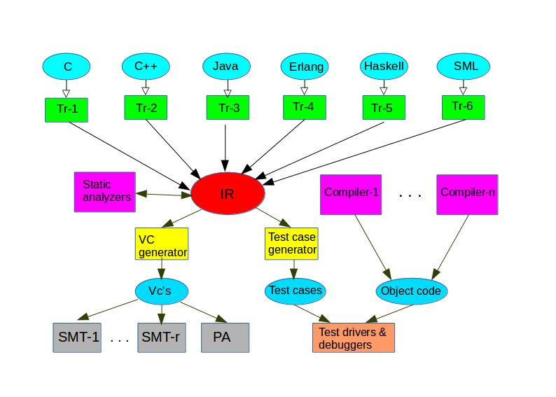
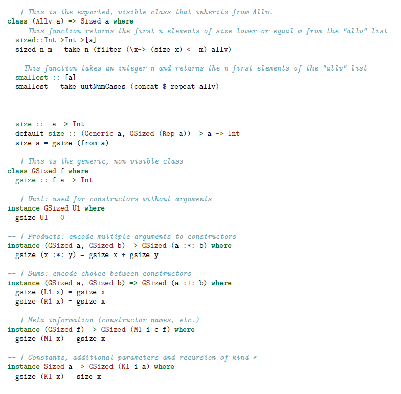
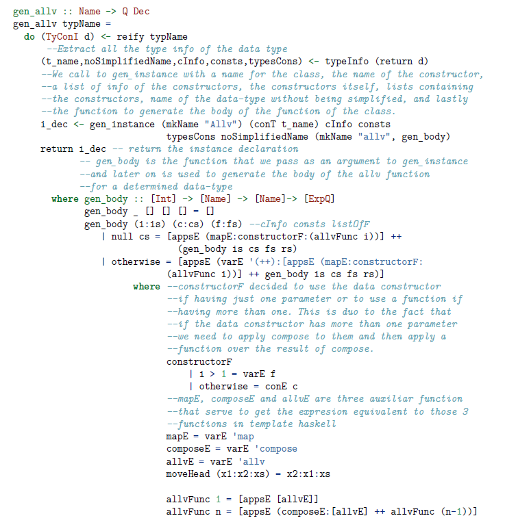
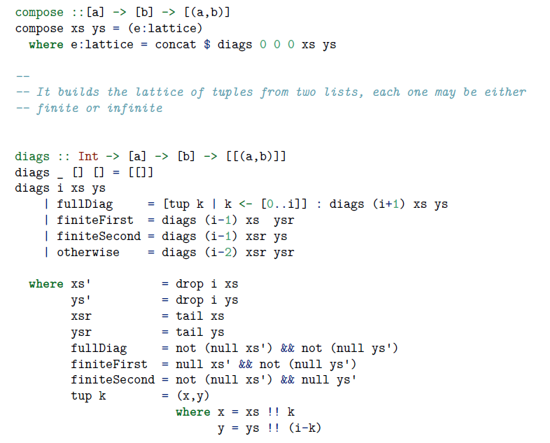
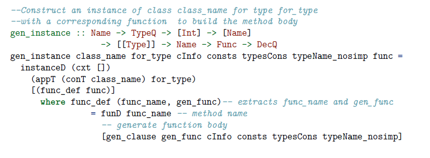
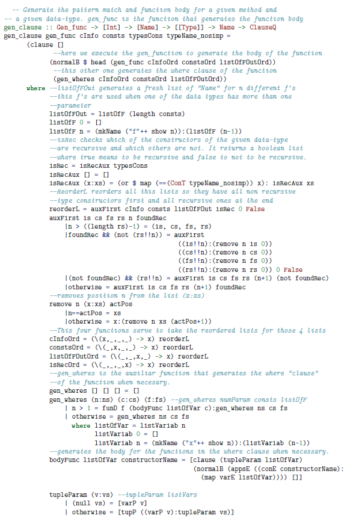

# 2. Preliminares

### 2.1: CAVI-ART Project
En esta seccion explicamos el proyecto CAVI-ART el cual es un proyecto actualmente en desarollo en la UCM y del cual forma parte mi TFG.

La plataforma **CAVI-ART** consiste en un conjunto de herramientas pensadas para ayudar al programador en la validacion de programas escritos en diferentes lenguajes. Estas ayudas incluyen la extracción automática y prueba de condiciones de verificación, la prueba automática de terminación (siempre que sea decidible usando la tecnología actual), la inferencia automática de algunos invariantes y la generación automática y ejecución de casos de prueba. [@caviart1; @caviart2; @caviart3]

Un aspecto clave de la plataforma es su Representación Intermedia de los programas (de aquí en adelante IR). Programas escritos en lenguajes convencionales como C++, Java, Haskell, OCaml y otros se traducen a la IR, sobre la cual se realizan todas las actividades mencionadas anteriormente. La intencion es programar la mayor parte de la plataforma una sola vez, de manera que sea independiente del lenguaje de programación utilizado.

El diseño de la IR fue realizado con la intencion de facilitar las tareas nombradas con anterioridad tanto como fuera posible. Un diseño simple que cuenta con muy pocas construcciones primitivas. Nunca se pensó en la IR como código ejecutable sino como una sintaxis abstracta sobre la cual resultaria fácil realizar análisis estático y verificación formal. Pero en los últimos meses se decidió convertir la IR en código ejecutable, sobre la cual sería posible ejecutar pruebas independientes del lenguaje, y construir herramientas de testeo independientes del lenguaje. La mayoría del trabajo hecho en este campo y la mayoría de las herramientas de testeo existentes están ligadas a un lenguaje en concreto. 

Dicho trabajo de traducir la IR a Haskell y hacer ejecutables los asertos se engloba dentro del trabajo de fin de grado de (nombre)

Esquema del proyecto CAVI-ART(Fig 1)



\pagebreak

### 2.2: QuickCheck

**Quickcheck** [@quickcheck] es una herramienta de Haskell pensada para probar funciones escritas en dicho lenguaje sobre un conjunto de casos de prueba generados de manera aleatoria. Dicho programa resultó ser de gran ayuda pues tiene ideas similares a lo que queríamos conseguir con nuestro proyecto ya que se trata tambien de un sistema de prueba tipo caja negra.
Aunque también cuenta con  algunas diferencias sobre todo en la generación de los casos de prueba, ya que **Quickcheck** los genera de manera aleatoria mientras que nuestro proyecto los genera de manera exhaustiva.

##### Ejemplo de funcionamiento del programa

Vamos a trabajar en este caso con la siguiente propiedad de las listas, cierta para cualquier lista finita.

```haskell
  prop_RevApp xs ys = 
    reverse (xs++ys) == reverse ys++reverse xs
```

Ahora lanzamos el programa **Quickcheck** para comprobar si pasa todos los casos de prueba.
```haskell
  Main> quickCheck prop_RevApp
  OK: passed 100 tests.
```
Veamos ahora que pasa en caso de que nuestra función no esté bien definida. 

```haskell
  prop_RevApp2 xs ys = 
    reverse (xs++ys) == reverse xs++reverse ys
```
Al ejecutar la nueva funcion desde **Quickcheck**.

```haskell
  Main> quickcheck prop_RevApp2
  Falsifiable, after 1 tests:
  [2]
  [-2,1]
```

Aquí podemos observar que en caso de fallo **Quickcheck** nos devuelve el contraejemplo de tamaño mínimo. Lo que nos dice esta vez es que nuestra definición ha fallado en el primer test y que en dicho caso las respectivas listas para las que ha sido probado falso son [2] y [-2,1].

#####Leyes condicionales
En algunos casos las leyes que queremos definir no pueden ser representadas mediante una simple función y solo son ciertas bajo unas precondiciones muy concretas. Para dichos casos **Quickcheck** cuenta con el operador de implicación **\texttt{==>}** para representar dichas leyes condicionales.
Por ejemplo una ley tan simple como la siguiente:
```haskell
  x <= y ==> max x y == y
```
Puede ser representada por la siguiente definición.
```haskell
  prop_MaxLe :: Int -> Int -> Property
  prop_MaxLe x y = x <= y ==> max x y == y
```

En este ejemplo podemos observar que el resultado de la función es de tipo **\texttt{Property}** en vez de **\texttt{Bool}**, lo cual es debido a que en el caso de las leyes condicionales en vez de probar la propiedad para 100 casos de prueba aleatorios, esta es probada contra 100 casos que cumplan la precondición establecida. Si uno de los candidatos no cumple la propiedad este será descartado y se considerará el siguiente. **Quickcheck** genera un máximo de 1000 casos de prueba y si entre ellos no se han encontrado al menos 100 que cumplan la precondición simplemente informa al usuario cuantos se han encontrado que la cumplan. Dicho límite está pensado para que el programa no busque indefinidamente en caso de que no existan más casos que cumplan dicha precondición.

#####Monitorizando los datos
Al testear propiedades debemos tener cuidado, pues quizás parezca que hemos probado una propiedad a fondo para estar seguros de su credibilidad pero esta simplemente ser aparente. Voy a intentar ejemplificarlo usando la inserción en una lista ordenada.
```haskell
  prop_Insert :: Int -> [Int] -> Property
  prop_Insert x xs =
    ordered xs ==>
      classify (null xs) "trivial" $
        ordered (insert x xs)
```
Esto nos permite saber cuantas de las pruebas se realizaron sobre una lista vacia. En cuyo caso la condición de **\texttt{ordered xs}** es trivial.
Si ejecutamos esta nueva función con **Quickcheck** obtenemos el siguiente mensaje.
```haskell
  Ok, passed 100 tests (43% trivial)
```
Es decir que el 43% de los tests realizados son sobre una lista vacia.

Pero a su vez **Quickcheck** nos ofrece la posibilidad de un mejor análisis, más alla de etiquetar uno de los casos que nos interese. Podemos realizar una especie de histograma, utilizando la palabra reservada **\texttt{collect}**, que nos dará una mayor información de la distribución de los casos de prueba, por ejemplo en este caso según su longitud.
```haskell
  prop_Insert :: Int -> [Int] -> Property
  prop_Insert x xs =
    ordered xs ==>
      collect (length xs) $
        ordered (insert x xs)
```
Al ejecutarlo obtendriamos un resultado como el siguiente, separado según los tamaños de las listas.
```haskell
  Ok, pased 100 tests.
  49% 0.
  32% 1.
  12% 2.
  4% 3.
  2% 4.
  1% 5.
```

######Definir generadores
En primer lugar vamos a empezar definiendo la clase de tipos **\texttt{Arbitrary}** de la cual un tipo es una instancia si podemos generar casos aleatorios de él. La manera de generar los casos de prueba depende por supuesto del tipo.
```haskell
  class Arbitrary a where
    arbitrary :: Gen a
```

**\texttt{Gen}**  es un tipo abstracto representando el generador para el tipo **\texttt{a}**, que bien puede ser el generador por defecto o uno creador por el programador para el caso específico. El tipo abstracto **\texttt{Gen}** se define como:
```haskell
  newtype Gen a = Gen (Rand -> a)
```
En esta definición **\texttt{Rand}** se trata de un número semilla aleatorio y un generador no es más que una función que puede generar una **\texttt{a}** de una manera pseudoaleatoria.

Ahora vamos a echarle un vistazo a las posibilidades que nos ofrece **Quickcheck** a la hora de definir los generadores de casos para los tipos de datos definidos por el usuario.

Supongamos que definimos el tipo **\texttt{Colour}** de la siguiente manera
```haskell
  data Coulour = Red | Blue | Green
```
Un ejemplo de un generador para dicho tipo en el cual los tres colores son equiprobables sería
```haskell
  instance Arbitrary Colour where
    arbitrary = oneof [return Red | return Blue | return Green]
```
en el cual podemos observar el funcionamiento de la función **\texttt{oneof}** que se encarga de devolver uno de los elementos de la lista dando la misma probabilidad a todos ellos.

Vamos a observar otro ejemplo, un generador para listas de un tipo **\texttt{a}** arbitrario.
```haskell
  instance Arbitrary a => Arbitrary [a] where
    arbitrary = frequency
      [ (1, return [])
        (4, liftM2 (:) arbitrary arbitrary)]
```
En ella usamos la función **\texttt{frequency}** la cual funciona similar a **\texttt{oneof}** pero dandole pesos diferentes a los diferentes casos. En este ejemplo le damos peso 1 a la lista vacia y peso 4 a la lista compuesta de otras 2 listas, con lo cual obtenemos casos de prueba de una longitud media de 4 y evitando de esta manera el problema visto antes de que la mayoría de los casos de prueba sean listas vacias.

### 2.3: Librería Generics de GHC

El siguiente punto a tratar en estos preliminares es la librería **Generics** del compilador GHC de Haskell[@generics], una librería utilizada principalmente para la generación automática de instancias de funciones correctas para cualquiera que sea el tipo de datos. En el caso de este proyecto **Generics** apareció como una librería necesaria para escribir nuestro programaz de manera que funcionaran para cualquier tipo de datos, incluídos los definidos por el usuario y de los cuales no podemos tener conocimiento en adelantado.

Dicha librería dentro de Haskell es posible por dos caracteristicas del propio lenguaje:

1. En primer lugar la existencia de las clases de tipos, que actuan como una interfaz de Java definiendo el comportamiento de las operaciones sobre los tipos que pertenecen a dicha clase.

2. En segundo lugar, gracias a la existencia del polimorfismo de tipo Ad-hoc. Este nos permite abstraer una operación sobre una o más clases de tipos simplemente con la condición de que el tipo concreto tenga unas propiedades como por ejemplo que sea ordenable (pertenezca a la clase **Ord**) o que sus elementos admitan comparaciones por igualdad (que pertenezca a la clase **Eq**).

En el caso de la librería \texttt{Generics} esta permite definir funciones genéricas para cualquiera que sea el tipo al que se apliquen ya que dicha definición se realiza sobre la estructura del tipo y teniendo en cuenta que todo tipo algebraico en Haskell utiliza un número pequeño de construcciones (uniones, productos cartesianos, recursion y tipos básicos).

En el caso de esta librería, la clase de tipos principal (Generic) expresa la posibilidad de describir un tipo de datos en términos de un conjunto simple de combinadores. Estos combinadores son:

- En primer lugar debemos definir el comportamiento deseado para los tipos de datos vacios (representados con **V1** en Generics)

- En segundo lugar debemos definir el comportamiento deseado para los tipos de datos cuyo constructor carece de parámetros (representados con **U1** en Generics).

- En tercer lugar se trata de definir el comportamiento para los tipos compuestos de acuerdo a como se forman. En Haskell los tipos compuestos solo pueden definirse mediante dos operaciones partiendo de los tipos básicos. Estas dos operaciones son la suma y el producto de tipos (representados como \texttt{:+:} y \texttt{:*:} respectivamente en **\texttt{Generics}**). Deberemos definir como queremos que sea el comportamiento de las funciones de nuestra clase genérica de acuerdo a como se forma nuestro tipo a partir de los tipos básicos.

- Por último están dos tipos para representar meta-información y etiquetado de tipos(representados respectivamente por **M1** y **K1**), que nos permitirán definir el comportamiento esperado para las funciones cuando esta depende de las etiquetas o parte de la meta-información del tipo.

Una vez definidas las funciones para estos cinco diferentes combinadores es necesario definir algunas instancias para los tipos predefinidos como **Int**, **Char**, **Boolean**... de manera que si el usuario crea un tipo complejo como por ejemplo un Diccionario con valores de **Int** como clave y **Char** como valores tengamos un punto de partida para construir mediante Generics las instancias en nuestra clase para los nuevos tipos de datos.

### 2.4 Template Haskell
En este apartado trataremos sobre **Template Haskell** [@template_haskell], una extensión sobre el lenguaje original que añade la posibilidad de realizar metaprogramación en Haskell, de una manera similar al sistema de templates de C++, de ahí su nombre, permitiendo a los programadores computar parte de la generación de código en tiempo de compilación dependiendo de las necesidades.

##### Un ejemplo de la idea básica
Imaginemos que escribir una funcion para imprimir un valor en Haskell siguiendo el estilo de C. Nos gustaría poder escribir algo como esto en Haskell:
```haskell
    printf ”Error: %s on line %d.” msg line
```
El caso es que en Haskell uno no puede definir **printf** de una manera tan sencilla pues su tipo depende del valor de su primer argumento. En **Template Haskell** en cambio podemos definir **printf** de manera que sea definido por el usuario, eficiente y garantice la seguridad de tipos de Haskell.

```haskell
    $(printf ”Error: %s on line %d”) msg line
```
El símbolo $ indica "evaluar en tiempo de compilación". La llamada a la función **printf** devuelve a Haskell una expresión que es insertada en el lugar de la llamada después de lo cual se puede realizar la compilación de la expresión. Por ejemplo el codigo entre parentesis:

```haskell
    $(printf ”Error: %s on line %d”)
```
 lo traduce en la siguiente expresión lambda en Haskell
```haskell
    (\ s0 -> \ n1 -> ”Error: ” ++ s0 ++ ” on line ” ++ show n1)
```
Sobre la cual se aplicará la comprobación de tipos y se aplicará sobre **msg** y **line**

##### Como usar template Haskell

Lo primero que hay que resaltar es el hecho que las funciones de **Template Haskell** que son ejecutadas en tiempo de compilación están escritas en el mismo lenguaje que las funciones utilizadas en tiempo de ejecución. Una gran ventaja de esta aproximación es que todas las librerías existentes y técnicas usadas en Haskell pueden ser utilizadas directamente en Template Haskell. Por otro lado, una de las posibles desventajas de esta aproximación puede ser la necesidad de tener que utilizar notaciones como "$" o "[||]" (conocidas como **splicing** y **quasi-quotes**) para especificar que partes del código se deben ejecutar en tiempo de ejecución y cuales en tiempo de compilación.

En los ejemplos más sencillos como el anteriormente presentado sobre como escribir una función printf en Template Haskell la notación del **splicing** o la **quasi-quotation** pueden resultar de gran ayuda. El problema es que tan pronto como empezamos a hacer cosas más complejas en meta-programación esta notación deja de ser suficiente. Por ejemplo no es posible definir una función para seleccionar el i-ésimo elemento de una tupla de n elementos usando solo esas dos notaciones. Dicha función en **Template Haskell** sería asi.

```haskell
    sel :: Int -> Int -> ExpQ
    sel i n = [| \x -> $(caseE [| x |] [alt]) |]
        where alt :: Match
              alt = simpleM pat rhs

              pat :: PatQ
              pat = ptup (map pvar as)

              rhs :: ExpQ
              rhs = var (as !! (i-1))

              as :: [String]
              as = ["a" ++ show i | i <- [1..n]]
```

Para explicar un poco este código vamos a empezar de abajo a arriba, para entender las partes que usaremos despues en la función principal **sel**.
En primer lugar **as** lo que hace es crear una lista de nombres de aes desde a1 hasta an. La segunda de ellas, **rhs** se encarga de coger el i-esimo elemento de la lista de aes y devolverlo como una variable de tipo **ExpQ** que es el tipo utilizado en **Template Haskell** para las expresiones. La función **pat** transforma en primer lugar la lista de **Strings** en una lista de variables de tipo **PatQ** que es el tipo utilizado en TH para referirse a los patrones y después junta dicha lista en una tupla de tipo **PatQ**. Después al realiza un emparejamiento de la tupla tipo **PatQ** con el **rhs** mediante la función **simpleM** (simple Match).
Finalmente la función **caseE** que toma como parametros una variable x (de tipo **ExpQ** como indica la quasi-quotation alrededor de x) y el emparejamiento devuelto por **alt**, realizando la sustituición de la **x** al lado izquierdo de la flecha por el patrón correspondiente y colocando al lado izquierdo de la flecha la **ExpQ** devuelta por **rhs** que es elemento de la tupla tomado.

Esta función se traduciria a una expresión lambda que por ejemplo si llamaramos a **sel 4 6** es decir el cuarto elemento de una tupla de 6 tendría esta forma
```haskell
    (\(a1,a2,a3,a4,a5,a6) -> a4)
```

##### Cosificación (Reification)
La **cosificación** es la herramienta presente en Template Haskell para permitir al programador preguntar sobre el estado de la tabla de símbolos que guarda el compilador. Por ejemplo se puede escribir un código como el siguiente:

```haskell
  module M where
  data T a = Tip a | Fork (T a) (T a)
  
    repT :: Decl
    repT = reifyDecl T

    lengthType :: Type
    lengthType = reifyType length

    percentFixity :: Q Int
    percentFixity = reifyFixity (%)

    here :: Q String
    here = reifyLocn
```

La primera de las funciones declaradas devuelve un resultado de tipo **Decl** (equivalente a **Q Dec**), representando la declaración del tipo **T**. El siguiente computo **reifyType length** devuelve un resultado de tipo **Type** (equivalente a **Q Typ**) representando el conocimiento del compilador sobre el tipo de la función **length**.
En tercer lugar **reifyFixity** devuelve la "fixity" de los argumentos de la función lo cual es muy util cuando se quiere deducir como imprimir algo. Finalmente **reifyLocn** devuelve un resultado de tipo **Q String** que representa la posición en el código fuente desde donde se ejecutó **reifyLocn**.

De esta manera la cosificacion devuelve un resultado que puede ser analizado y utilizado en otros cálculos, pero hay que recordar que al tratarse de una herramienta del lenguaje para acceder a la tabla de símbolos y estar encapsulado dentro de la monada **Q** no puede ser usada como una función, por ejemplo con la función map (**map reifyType xs** sería incorrrecto).

\pagebreak

# 3. Nuestra propuesta: las clases Allv, Sized y Arbitrary

### 3.1: Black box testing en nuestro contexto

En cuanto al mundo del testing existen dos grandes posibilidades, sistemas de tipo caja negra o sistemas de tipo caja blanca. En primer lugar los de caja negra son aquellos sistemas de testing que no se basan en la estructura interna si no que trabajan únicamente con la entrada sobre la que aplican una precondición y la salida sobre la que comprueban si cumple las postcondiciones establecidas. 
En cambio los de caja blanca testean no solo las entradas y salidas del programa aplicandoles precondiciones y comprobando la postcondiciones si no que además se basan en la estructura interna del programa para realizar la generación de casos de prueba de forma que se cubra todo el texto del programa. Segun el criterio de cobertura deseado se pueden generar casos para ejercitar todas las condiciones o todas las ramas o todos los caminos.

En el caso de nuestro proyecto nos decidimos por el método de caja negra pues queríamos conseguir un sistema válido para poder probar cualquier programa sin necesidad de tener que adaptar nuestra plataforma para cada nuevo programa, es decir que funcionase fuese cual fuese el programa bajo prueba. Esa es una de las desventajas del testeo de tipo caja blanca que para poder comprobar partes de la estructura interna de un programa tienes que adaptar la plataforma para cada uno de los nuevos programas.

La idea principal detras de nuestro proyecto era principalmente la inmediatez y la comodidad del usuario, es decir que para probar un programa no necesitara escribir código extra aparte del ya existente programa si no que solo debe especificar como quiere que se generen los casos de prueba y los rangos de los dominios a usar y con eso ser ya capaz de probar su programa lo cual se ajusta mucho más a la idea de testeo de caja negra.

Las posibles maneras en las que el usuario puede especificar que se generen los casos de prueba para cada argumento son 3:
  - O generar *n* casos de prueba de manera aleatoria.
  - O coger *n* casos de prueba de tamaño menor o igual a *m*.
  - O coger los *n* primeros casos de prueba de la lista de todos los valores, sea cual sea su tamaño.

### 3.2: Sized

En la estructura del proyecto **\texttt{Sized}** está pensada como la clase externa que hereda de **\texttt{Allv}**. A su vez es la clase que se ocupa de a partir de la lista **\texttt{allv}** de un tipo de datos devolver la lista de los casos de prueba. Esto se realiza mediante dos funciones:
  - **\texttt{sized}** que devuelve los **\texttt{n}** primeros casos menores o iguales a un tamaño *m*.
  - **\texttt{smallest}** que devuelve  los **\texttt{n}** primeros casos de la lista **allv** según su posición y sin importar su tamaño.

En esta clase del proyecto decidimos implementar el concepto de tamaño de un elemento mediante la librería **Generics** explicada anteriormente pues de esa manera podríamos tener una representación del tamaño independiente del tipo y no hay que definirlo para cada tipo nuevo creado por el usuario. (Fig 2)

En primer lugar debemos definir la clase externa de la parte de **Generics** que será la que nosotros usemos. En ella solo debemos definir las funciones que queremos que tenga y como se comunica con la clases internas de **Generics**. Primero definimos la funcion en si que será una lista que dada un elemento de un tipo cualquiera nos devuelva un entero que representará su tamaño.

Despues debemos definir como se comunica la función **\texttt{size}** externa con la versión genérica **gsize** para obtener de esta el valor a devolver. En este caso usamos la función **from** que lo que hace es transformar un valor en su representación no genérica y transformarlo a su representación genérica para que pueda ser manipulado en las diferentes funciones. En este caso es simple pues el valor del tamaño obtenido por **gsize** será el mismo devuelto por nuestra función **size**. Finalmente creamos la clase interna **\texttt{GSized}** y definimos la función **\texttt{gsize}**.

Una vez tenemos la interfaz entre las dos clases **\texttt{Sized}** y **\texttt{GSized}** lo primero que debemos definir es el constructor sin argumentos que en nuestro caso devuelve el tamaño 0. A continuacion definimos**\texttt{size}** para un tipo compuesto por otros dos tipos, el tamaño de dicho tipo es la suma de los tamaños de los tipos que los componen. Tras ello definimos el comportamiento cuando el tipo tiene mas de un constructor posible, en este caso si elegimos el constructor de la derecha el tamaño del tipo será el tamaño del tipo de la derecha y similar si elegimos el tipo de la izquierda. Por último tenemos la instancia utilizada para trabajar con metainformación del tipo, que en nuestro caso al no ser necesaria dicha información simplemente llamamos de nuevo a la funcion **gsize** ignorando la metainformación.



\pagebreak

### 3.3: Allv/TemplateAllv

En primer lugar vamos a tratar la clase **Allv**, cuyas instancias cuentan unicamente con una función, **allv** la cual devuelve la lista de todos los posibles valores del tipo de datos. 

Al principio esta clase estaba pensada para ser una única clase que utilizara la librería **Generics** y para contar con un método, **compose** con el cual ser capaces de generar instancias de la clase **Allv** para los tipos definidos por el usuario. Dicha función se encargaría de crear la lista de todos los valores (**allv**) para el nuevo tipo de datos a partir de las listas de los tipos predefinidos, pero encontramos un problema a la hora de integrarlo con la clase **Sized**. La idea que teníamos sobre **Sized** era darle al usuario la posibilidad de pedir los *n* valores mas pequeños de una clase o los *n* primeros valores de tamaño menor o igual a un número prefijado por él.
Lo cual entraba en conflicto con la manera en la que generábamos las listas de **allv** para los tipos definidos por el usuario.
Para realizar la composición de dos listas seguimos el método mostrado en la siguiente figura.

//////////IMAGEN EXPLICATIVA COMPOSE///////////////////// 


Dadas dos listas la idea es realizar el producto cartesiano de ellas siendo este el resultado de generar todas las parejas con un valor de la primera lista y otro de la segunda. Teniendo en cuenta que ambas pueden ser infinitas, dicho producto deberá ser realizado por diagonales.
Dicha combinación de listas infinitas podía ser realizada sin problemas usando **Generics** pero el problema llegaba a la hora de querer devolver los *n* primeros valores de un tamaño menor o igual a *m* ya que para ello debíamos ordenar la lista infinita y encontramos el problema de que en dichas listas infinitas los elementos de un tamaño siempre eran infinitos y que siempre habría algun elemento a mayores de tamaño menor o igual a *m* aunque fuera despues de muchos elementos por el medio que no lo fueran. Dicho problema fue el por que tuvimos que pensar en utilizar **Template Haskell** en lugar de **Generics**.

En la versión definitiva del programa en la clase **TemplateAllv** se encuentra esta funcionalidad de crear una instancia de **Allv** para los tipos de datos definidos por el usuario utilizando para ello **TemplateAllv**, con la ayuda de la ya nombrada funciónn **compose**(Fig 4) que tiene la siguiente forma.

**Compose** se encarga de concatenar todas las diagonales en una única lista final que es la que se devuelve mediante la función **allv**, por otro lado **diags** se encarga de crear una de las diagonales y mientras no sea la ultima diagonal volver a llamarse a si misma con los parametros para la siguiente. Los parámetros de la función **diags** son:
  - **i** se trata del ordinal de la diagonal que vamos a generar.
  - **xs** e **ys** se tratan de las dos listas que vamos a combinar.

Además dentro de **\texttt{TemplateAllv}** tres funciones se encargan de crear una instancia adecuada de la clase **\texttt{Allv}** adecuada para cada uno de los tipos de datos definidos por el usuario.

La primera de ellas y la más externa en dicho proceso es **gen_allv**(Fig 3), la cual además de llamar a **typeInfo** para extraer la información del tipo y pasarsela a las subfunciones también es donde se define como se formará exactamente la nueva función **allv** dentro de la instancia del tipo. Adjunto el código de la función **gen_allv**. 

Vamos a echar un vistazo mas de cerca a dicha función **gen_body** dentro de la clausula **where** y al tipo de comprobaciones o analisis sobre el tipo que realiza. En primer lugar nombrar lo que significa cada una de las cuatro listas que recibe como parámetro dicha función:
  - La primera de ellas contiene los números de parámetros de cada uno de los diferentes constructores.
  - La segunda contiene los nombres de los diferentes constructores.
  - La tercera una lista de nombres de **f's** entre **f~1~** y **f~n~** siendo *n* el número de constructores distintos para el tipo de datos.
**Gen_body** se encarga de analizar el número de parámetros de cada uno de los constructores ya que si cuenta con un único parámetro, se puede utilizar el nombre del propio constructor sin ningún problema pero en caso de tener más de un parámetro debido a que compose devuelve la lista compuesta como una lista de tuplas, es necesario utilizar una función auxiliar **f** para realizar la aplicación del constructor sobre los elementos de la tupla en lugar de sobre la tupla en si.
Aparte de esto **gen_body** se encarga de utilizando **Template Haskell** conseguir juntar todas las partes que fueron en parte preprocesadas en **gen_clause**

La siguiente función a tratar, **gen_instance**(Fig 5) se encarga únicamente de crear una instancia de la clase **Allv** para el nuevo tipo de datos (parámetro **for_type**) y adjuntar a dicha instancia la definición de la función **allv** que se crea en **gen_clause**. Adjunto el código de **gen_instance**


Por último tenemos la función **gen_clause**(Fig 6) que se encarga de crear la definición de la función **allv** para el tipo de datos, usando para ello la función **gen_body** que había sido definida anteriormente en **gen_allv**.
Además cuenta con una serie de funciones auxiliares que realizan parte del procesamiento:
  - **listOfFOut** se encarga de crear la lista de nombres de variables entre **f~1~** y **f~n~** para aquellos casos en los cuales los constructores tienen más de un parámetro.
  - **isRec** devuelve una lista de booleanos en la cual cada posición indica si el constructor en dicha posición es recursivo o no.
  - **reorderL** se encarga de reordenar los constructores (lo cual es equivalente a las listas con la información por cada constructor) de manera que queden en primer lugar aquellos que no son recursivo y al final los que si lo son. Esto es necesario ya que los constructores recursivos harán uso de aquellos que no lo son y por ello los no recursivos deben definirse en primer lugar.
  - **gen_wheres** que se encargará de definir las clausulas where necesarias para todos aquellos constructores con más de un parámetro que necesiten utilizar una función auxiliar (que son las representadas por las **f's**).
  - **tupleParam** crea las tuplas de parámetros para cada una de las funciones auxiliares **f**.










\pagebreak

### 3.4: Arbitrary


### 3.5: Instancias predefinidas
En este último apartado vamos a repasar las instancias dentro de las clases **Sized** y **Allv** para los tres tipos básicos (**Int**, **Char**y **Bool**) y para los tipos que se deducen directamente de ellos como es el caso de listas de cualquier tipo ya instanciado en dichas clases o las tuplas de hasta longitud 6.

Adjunto el código donde se instancian dichos tipos en las dos clases que se encuentran en el archivo **Sized.hs**.
```haskell
  instance Sized Int where
    size x = 1

  instance Allv Int where
    allv = [1..100]

  instance Sized Char where
    size x = 1

  instance Allv Char where
    allv = ['a'..'z']

  instance Sized Bool where
    size x = 1

  instance Allv Bool where
     allv = [True, False]
```

Como podemos observar en el caso de la instancia en la clase **Sized** cualquier elemento de uno de los tres tipos tendrá tamaño uno. En el caso de las instancias de los tres tipos en la clase **Allv** simplemente debemos indicar el conjunto de valores de dicha clase que serán elegibles a la hora de generar casos de prueba.

A continuación nos encontramos con las instancias derivadas de tipos ya definidos en Allv.

```haskell
  instance Allv a => Allv [a] where
     allv = [] : map (\(x,xs) -> x:xs) $ compose (allv::a) (allv::[a])

  instance (Allv a, Allv b) => Allv (a,b) where
     allv = compose allv allv

  instance (Allv a, Allv b, Allv c) => Allv (a,(b,c)) where
     allv = compose allv (compose allv allv)

  instance (Allv a, Allv b, Allv c, Allv d) => Allv (a,(b,(c,d))) where
     allv = compose allv (compose allv (compose allv allv))

  instance (Allv a, Allv b, Allv c, Allv d, Allv e) => Allv (a,(b,(c,(d,e)))) where
     allv = compose allv (compose allv (compose allv (compose allv allv)))

  instance (Allv a, Allv b, Allv c, Allv d, Allv e, Allv f) => Allv (a,(b,(c,(d,(e,f))))) where
     allv = compose allv (compose allv (compose allv (compose allv (compose allv allv))))
```
Para las cuales utilizamos la función de **compose** explicada con anterioridad.

En el caso de las instancias derivadas dentro de la clase Sized nos encontramos que estas se generan mediante generics.

Estaba tambien pensado incluir dentro del archivo **Arbitrary.hs** las instancias de estos tres tipos y las instancias derivadas a partir de ellos para la clase Arbitrary, pero por falta de tiempo se decidió centrarse en la parte de Sized.

\pagebreak

# 4. El generador de casos

### 4.1: La interfaz con la UUT
La interfaz de mi programa con la unidad bajo testeo (UUT a partir de ahora) se encuentra en el archivo UUT.hs, dicho archivo es diferente para cada función que vayamos a probar y contiene la información mínima necesaria para poder hacer todas las pruebas. Ademas dicho archivo se genera automáticamente para cada función que vayamos a probar mediante la IR2Haskell, que se encarga de traducir la representacion de la IR a codigo Haskell.
La información presente en la UUT es:
- En primer lugar una función uutNargs que devuelve un entero y que indica el número de argumentos que tiene la función que vamos a probar.
- En segundo lugar **\texttt{uutMethods}** que contiene los nombres de las tres funciones que tendremos que utilizar en el proceso ( precondicion, funcion y postcondicion).
-A continuacion la precondicion en este caso **\texttt{uutPrec}**, la funcion **\texttt{uutMethod}** y postcondicion **\texttt{uutPost}**. Estas tres funciones serán las que guien todo el proceso de prueba de la función para la lista de casos generados.

```haskell
  module UUT where

  uutNargs ::Int
  uutNargs = 2

  uutMethods :: [String]
  uutMethods = ["uutPrec", "uutMethod", "uutPost"]

  uutPrec :: Int -> Int -> Bool
  uutPrec x y = True

  uutMethod :: Int -> Int -> Int
  uutMethod x y = x+y

  uutPost :: Int -> Int -> Int -> Bool
  uutPost x y z = True
```
### 4.2: La obtencion del tipo de la UUT
Dentro del programa, una de las partes importantes y la principal por la cual Template Haskell resultó de gran utilidad para el proyecto es poder analizar los tipos de las funciones y adaptar el generador de casos a ellos, tanto si son tipos predefinidos, como si son tipos definidos por el usuario.

Dentro de **\texttt{TemplateAllv}** se encuentra la funcion  **typeInfo**  que se encarga de extraer y sintetizar la información sobre un tipo declarado por el usuario. Se trata de una función que recibe como parametro una variable del tipo **DecQ** y devuelve una tupla dentro de la monada **Q** con la siguiente información:
  - En primer lugar el nombre simplificado del tipo del cual vamos a realizar la instancia, refiriendome con simplificado a quitar toda la parte del nombre que se refiere a la estructura de módulos de la cual se hereda dicho tipo. Por ejemplo si crearamos una instacia para el tipo **Integer** del módulo **Prelude** el nombre del tipo sin simplificar sería **Prelude.Integer** y una vez simplificado simplemente **Integer**. Dicho nombre se trata de una variable de tipo **Name**, que es la manera en la que se maneja el tipo **String** en **TH** para todo tipo de nombres.
  - El segundo se trata del nombre del tipo sin simplificar, devuelto tambien como una variable de tipo **Name**.
  - El tercero es una lista de enteros para cada uno de los diferentes constructores del tipo. Los enteros expresan el número de argumentos de cada uno de uno de los constructores.
  - El cuarto se trata de una lista de los diferentes nombres de los constructores de tipo. Se trata de una lista de tipo **Name**
  - El último se trata de una lista de listas. Cada una de las listas internas contiene los tipos para uno de los constructores del tipo.

En el código a continuación muestro tanto el código para la función **typeInfo** como para la funcion **simpleName** que es la encargada de simplificar el nombre de la función.


```haskell
  typeInfo :: DecQ -> Q (Name, Name,[Int],[Name],[[Type]])
  typeInfo m =
       do d <- m
          case d of
             d@(DataD _ _ _ _ _) ->
              return $ (simpleName $ name d, name d , consA d, termsA d, listTypesA d)
             d@(NewtypeD _ _ _ _ _) ->
              return $ (simpleName $ name d, name d , consA d, termsA d, listTypesA d)
             _ -> error ("derive: not a data type declaration: " ++ show d)
   
       where
          consA (DataD _ _ _ cs _)    = map conA cs
          consA (NewtypeD _ _ _ c _)  = [ conA c ]

          conA (NormalC c xs)         = length xs
          conA (RecC c xs)            = length xs
          conA (InfixC _ c _)         = 2
   
          nameFromTyVar (PlainTV a)    = a
          nameFromTyVar (KindedTV a _) = a
   
          termsA (DataD _ _ _ cs _)   = map termA cs
          termsA (NewtypeD _ _ _ c _) = [ termA c ]
   
          termA (NormalC c xs)      = c
          termA (RecC c xs)         = c
          termA (InfixC t1 c t2)    = c
   
          name (DataD _ n _ _ _)      = n
          name (NewtypeD _ n _ _ _)   = n
          name d                      = error $ show d

          listTypesA (DataD _ _ _ cs _)    = (map typesA cs)
          listTypesA (NewtypeD _ _ _ c _)  = [ typesA c ]

          typesA (NormalC _ xs)         = map snd xs
          typesA (RecC _ xs)            = map (\(_, _, t) -> t) xs
          typesA (InfixC t1 _ t2)       = [snd t1] ++  [snd t2]
   
  simpleName :: Name -> Name
  simpleName nm =
     let s = nameBase nm
     in case dropWhile (/=':') s of
          []          -> mkName s
          _:[]        -> mkName s
          _:t         -> mkName t
```

El otro gran punto en el cual necesitamos analizar el tipo de las funciones es a la hora de crear los casos de prueba, y de ello se encarga la función **\texttt{get_f_inp_types}** la cual que dada una **\texttt{String}** que será el nombre de una función nos devuelve una lista con los tipos de entrada de dicha funcion en forma de lista de **\texttt{Strings}**.
Esta funcion consta de 4 pasos o llamadas a otras funciones:
  - En primer lookupValueName, que es una funcion de la libreria **\texttt{Template Haskell}** y que lo que hace es dado una String que será el nombre de una funcion nos devuelve el Name asociado a ella dentro del namespace actual.
  - La segunda función se trata de extract_info, la cual recibe como entrada un InfoQ el cual es un tipo que se usa dentro de Template Haskell para encapsular información como por ejemplo en este caso la información devuelta por el reify del Name de la función. A partir de ello extract_info nos devolvera el nombre de la funcion sin el prefijo del modulo, el nombre de la función con el prefijo y por último el tipo de la función en forma prefija.
  - En tercer lugar simplifyParsing que recibe como entrada el tipo de una función en forma prefija y lo transforma a forma infija, que es la manera en el que indicamos por ejemplo en tipo de la función cuando lo ponemos explícitamente en Haskell.
  - Finalmente la ultima función extract_types se encarga de transformar el tipo de la función en forma infija a una lista con los tipos de entrada de la misma, ignorando el tipo de salida.


```haskell
  ----------------Get types for the input params------------------------------
  get_f_inp_types :: String -> Q [String]
  get_f_inp_types str = do (Just name) <- lookupValueName str
                           (_,_,text) <- extract_info (reify name)
                           t <- return(simplifyParsing text)
                           return (extract_types t [] "")
   
   
   --------Auxiliar functions for get_f_inp_types ------------------------------
   
  extract_info :: InfoQ -> Q(Name, Name, String)
  extract_info m =
        do d <- m
           case d of
              d@(VarI _ _ _ _) ->
               return $ (funcName d, simpleName $ funcName d, parseDataTypes d)
              d@(ClassOpI _ _ _ _) ->
               return $ (funcName d, simpleName $ funcName d, parseDataTypes d)
              _ -> error ("Error in extract_info" ++ show d)
        where
           funcName (VarI n _ _ _)  = n
           funcName (ClassOpI n _ _ _) = n
   
           parseDataTypes (VarI _ x _ _) = first_parse x
           parseDataTypes (ClassOpI _ x _ _) = first_parse x
   
           first_parse ((ForallT _ _ x)) = parsing x
           first_parse x = parsing x
    
           parsing ((AppT x y)) = (parsing x) ++ (parsing y)
           parsing (ArrowT) = "-> "
           parsing (ListT) = "[] "
           parsing ((TupleT 2)) = "(,) "
           parsing ((TupleT 3)) = "(,,) "
           parsing ((VarT _)) = "Int "
           parsing ((ConT x)) = (nameBase x) ++ " "
           parsing _ = "UND "
   
   
  simpleName :: Name -> Name
  simpleName nm =
      let s = nameBase nm
      in case dropWhile (/=':') s of
           []          -> mkName s
           _:[]        -> mkName s
           _:t         -> mkName t

  simplifyParsing :: String -> String
  simplifyParsing string = fst (auxiliarParse string)
   
  auxiliarParse s
       | startswith "->" (lstrip s) = ( (fst call2) ++ " -> " ++ (fst (call 0 (snd call2))) , snd (call 0 (snd call2)))
       | startswith "[]" (lstrip s) = ("[" ++ (fst call2) ++ "]", snd call2)
       | startswith "(,)" (lstrip s) = ("(" ++ (fst call3) ++ "," ++ (fst (call 0 (snd call3))) ++ ")" , snd (call 0 (snd call3)))
       | startswith "(,,)" (lstrip s) = ("(" ++ (fst call4) ++ "," ++ (fst (call 0 (snd call4))) ++ "," ++ (fst (call 0 (snd (call 0 (snd call4))))) ++ ")" , snd (call 0 (snd (call 0 (snd call4)))))
       | startswith "(,,,)" (lstrip s) = ("(" ++ (fst call5) ++ "," ++ (fst (call 0 (snd call5))) ++ "," ++ (fst (call 0 (snd (call 0 (snd call5))))) ++ "," ++ (fst (call 0 (snd (call 0 (snd (call 0 (snd call5))))))) ++ ")" , snd (call 0 (snd (call 0 (snd (call 0 (snd call5)))))) )
       | otherwise = baseVar (lstrip s) ""
   
   
   
       where call2 = call 2 s
             call3 = call 3 s
             call4 = call 4 s
             call5 = call 5 s
             call n string = auxiliarParse (stringSkip n (lstrip string))
             stringSkip n (x:xs)
                | n == 0 = (x:xs)
                | otherwise = stringSkip (n-1) xs
             baseVar s formedS
                | (head s) /= ' '  = baseVar (tail s) (formedS ++ [head s])
                | otherwise = (formedS , (lstrip (tail s)))

   -------------Extracts the input types from the simplify parsing----------
   
  extract_types :: String -> [String] -> String -> [String]
  extract_types [] list _ = list
  extract_types (x1:xs) list building_t
        | (x1 == ' ') || (x1 == '>') = extract_types xs list building_t
        | (x1 == '-')= extract_types xs (list++[building_t]) ""
        | otherwise = extract_types xs list (building_t++[x1])
```

### 4.3 La generación de instancias de Allv, Sized, Arbitrary

### 4.4: La generación de casos

### 4.5: La ejecución de casos

\pagebreak

# 5.Experimentos

\pagebreak

# 6. Related

### 6.1: Korat

La primera de las herramientas que vamos a tratar en este apartado se trata de **Korat** [@korat], una extensión de Java que sirve para la generación de casos complejos de prueba a partir de unas restricciones dadas.

La idea detras de **Korat** es que dado un predicado en Java y una función **finitialization** en la cual definimos los dominios para cada uno de las clases del input, es decir los valores válidos para cada una de ellas. **Korat** explora el espacio de estados de las posibles soluciones pero generando solo soluciones no-isomorficas entre si, consiguiendo de esta manera una gran poda de las soluciones no interesantes del espacio de búsqueda.

Lo primero que hace **Korat** es reservar el espacio necesario para los objetos especificados por ejemplo en el caso de un **BinTree** reservaria espacio para él y para el número de Nodos que queramos. Por ejemplo si queremos un arbol con tres nodos el vector contendría 8 campos:
* 2 para el **BinTree** (uno para la raíz y otro para el tamaño)
* 2 campos por cada uno de los 3 nodos (hijo izquierdo/hijo derecho)

Cada uno de los posibles candidatos que considere **Korat** a partir de ese momento será una evaluación de esos 8 campos. Por lo tanto el espacio de estados de búsqueda del input consiste en todas las posibles combinaciones de esos campos, donde cada uno de ellos toma valores de su dominio definido en **finitialization**


Para conseguir explorar de manera sistemática y completa el espacio de estados **Korat** ordena todos los elementos en los dominios de las clases y los dominios de los campos. Dicho orden de cada uno de los dominios de los campos será consistente con el orden del dominio de la clase y todos los valores que pertenezcan al mismo dominio de clase ocurriran de manera consecutiva en el dominio del campo. Tras esto representa cada candidato de la entrada como un vector de índices de sus correspondientes dominios de campos.

Tras definir los dominios de cada uno de los campos del vector la busqueda comienza con la inicialización de todos los indices del vector a 0. Tras ello para cada posible candidato fijamos los valores de los campos de acuerdo a los valores en el vector y acto seguido invoca a la funcion **repOk** que es donde el usuario ha definido la precondición de la función. Durante dicha ejecución **Korat** monitoriza en que orden son accedidos los campos del vector y construye una lista con los identificadores de los campos, ordenados por la primera vez en que **repOk** los accede.

Cuando **repOk** retorna **Korat** genera el siguiente candidato incrementando el indice del dominio de campo para el campo que se encuentra último en la lista ordenada construida previamente. Si dicho indice es mayor que el tamaño del dominio de su campo este se pone a cero y se incrementa el indice de la posición anterior y así repetidamente. Al seguir este método para generar el siguiente candidato conseguiremos podar un gran numero de los candidatos que tienen la misma evaluación parcial sin dejar fuera ninguno válido.

El algoritmo de busqueda descrito aquí genera las entradas en orden lexicográfico. Además para los casos en los que **repOk** no es determinista este método garantiza que todos los candidatos para los que **repOk** devuelve true son generados, los casos para los que siempre devuelve false nunca son generados y los casos para los que alguna vez se devuelve true y a veces false pueden ser o no generados.

Dos candidatos se definen como isomorfos si las partes de sus grafos alcanzables desde la raíz son isomorfas. En el caso de **repOk** el objeto raíz es el objeto pasado como argumento implícito.

El isomorfismo entre candidatos divide el espacio de estados en particiones isomórficas (debido al ordenamiento lexicográfico introducido por el orden de los valores de los dominios de los campos y la ordenación de los campos realizado por **repOk**). Para cada una de dichas particiones isomomorficas **Korat** genera únicamente el candidato lexicográficamente menor.

Además con el proceso explicado anteriormente para ir generando el siguiente candidato teniendo en cuenta la lista de ordenación de los campos **Korat** se asegura de no generar varios candidatos dentro de la misma partición isomórfica.

### 6.2: Smallcheck

La segunda herramienta a tratar en este apartado es **Smallcheck** [@smallcheck] una librería para Haskell usada en el testing basado en propiedades. Esta librería parte de las ideas del **Quickcheck** y perfecciona algunos de los puntos flacos de este.

La principal diferencia de **Smallcheck** respecto a **Quickcheck** es la generación de sus casos de prueba. En este caso **Smallcheck** se apoya en la "hipótesis del ámbito pequeño" la cual dice que si un programa no cumple su especificación en alguno de sus casos casi siempre existirá un caso simple en el cual no la cumpla o lo que viene a ser lo mismo, que si un programa no falla en casos pequeños lo normal es que no falle en ninguno de sus casos.

Partiendo de esta idea cambia la generación existente en **Quickcheck**, la cual era aleatoria, por una generación exhaustiva de todos los casos de prueba pequeños ordenados por **profundidad** (que es el nombre usado para el tamaño), dejando a criterio del usuario hasta que profundidad deben considerarse como pequeños. A continuacion presentamos como están definidas las profundidades más importantes:

- En el caso de los tipos de datos algebraicos como es usual la profundidad de una construcción de aridad cero es cero mientras que la profundidad de una construcción de aridad positiva es una más que la mayor profundidad de todos sus argumentos.

- En el caso de las tuplas dicha profundidad se define un poco diferente. La profundidad de una tupla de aridad cero es cero pero la profundidad de una tupla de aridad positiva es simplemente la mayor profundidad de entre todas las de sus componentes.

- En el caso de los tipos numéricos la definición de la profundidad es con respecto a una representación imaginaria como una estructura de datos. De esta manera, la profundidad de un entero *i* será su valor absoluto, ya que se construyó de manera algebraica como **Succ^i^ Zero**. A su vez, la profundidad de un numero decimal **s x 2^e^** es la profundidad del par de enteros (s,e).

**Smallcheck** define una clase **Serial** de tipos que pueden ser enumerados hasta una determinada profundidad. Para todos los tipos de datos del preludio existen instancias predefinidas de la clase **Serial**. Sin embargo definir una nueva instancia de dicha clase para un tipo de datos algebraico es muy fácil, se trata de un conjunto de combinadores **cons<N>**, genéricos para cualquier combinación de tipos Serial, donde **<N>** es la aridad del constructor.

Por ejemplo supongamos un tipo de datos en Haskell **Prop** en el cual tenemos una variable, la negación de una variable y el **Or** de dos variables

```haskell
  data Prop = Var Name | Not Prop | Or Prop Prop
```

Definir una instancia de la clase **Serial** para dicho tipo de datos sería como sigue. Asumiendo una definición similar para el tipo **Name**. 

```haskell
  instance Serial Prop where
    series = cons1 Var \/ cons1 Not \/ cons2 Or
```
Una serie simplemente es una función que dado un entero devuelve una lista finita.

```haskell
  type Series a = Int -> [a]
```

A su vez el producto y la suma sobre dos series se definen como:
```haskell
  (\/) :: Series a -> Series a -> Series a
  s1 \/ s2 = \d -> s1 d ++ s2 d

  (><) :: Series a -> Series b -> Series (a, b)
  s1 >< s2 = \d -> [(x,y) | x <- s1 d, y <- s2 d]
```
 Por último los combinadores **cons<N>** están definidos usando **><** decrementando y comprobando la profundidad correctamente.

 ```haskell
  cons0 c = \d -> [c]
  cons1 c = \d -> [c a | d > 0, a <- series (d-1)]
  cons2 c = \d -> [c a b | d > 0, (a,b) <- (series >< series) (d-1)]
 ```


Usar el esquema general para definir series de valores de prueba muchas veces produce que para alguna profundidad pequeña **\texttt{d}** los 10.000-100.000 casos de prueba son rápidamente comprobados pero para la profundidad **\texttt{d+1}**  resulte imposible completar los miles de millones de casos de prueba. Por ello resulta necesario reducir algunas dimensiones del espacio de busqueda de manera que otras de las dimensiones puedan ser comprobadas en mayor profundidad.

El primer punto a tener en cuenta es que a pesar de que los números enteros pueden parecer una elección obvia como valores bases para las pruebas debemos tener en cuenta que los espacios de busqueda para los tipos compuestos (especialmente funcionales) al usar bases numéricas crecen de manera muy rápida. En muchos casos el tipo booleano puede ser una elección perfectamente válida para los valores bases y con ello se conseguiría reducir en gran medida el espacio de busqueda respecto a la utilización de enteros.

Existe otra version de **Smallcheck** llamada **Lazy Smallcheck**, que a su vez se aprovecha de la evaluación perezosa de Haskell, la cual permite que una función devuelva un valor aunque esta esté aplicada sobre una entrada definida parcialmente. Esta posibilidad de ver el resultado de una función sobre muchas entradas en una sola ejecución puede resultar de gran ayuda en el testeo basado en propiedades ya que si una función se cumple para una solución parcial, esta se cumplirá para todas las funciones totalmente definidas que partan de dicha definición parcial. En eso se centra el **Lazy Smallcheck**, en evitar generar todas esas funciones totalmente definidas que no aportan nada de información extra sobre la definición parcial. La actual versión de **Lazy Smallcheck** es capaz de testear propiedades de primer orden con o sin cuantificadores universales.

#References