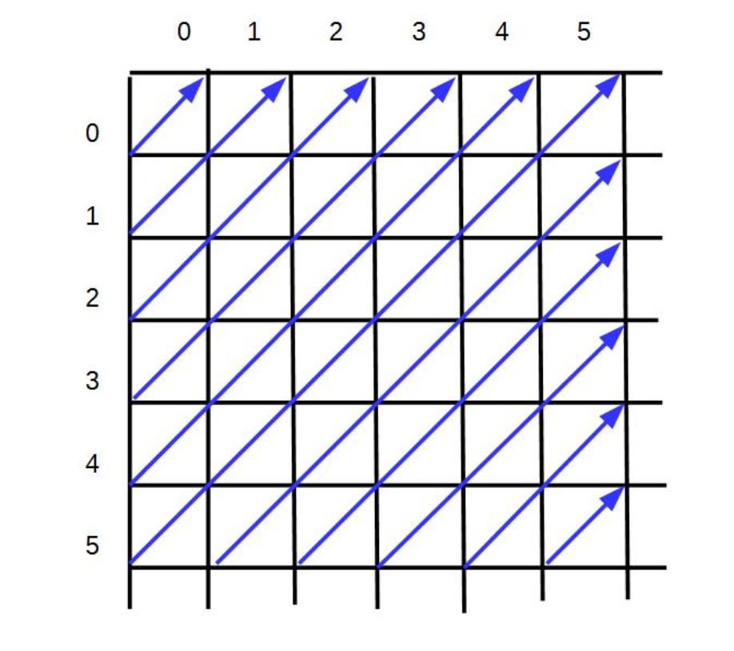
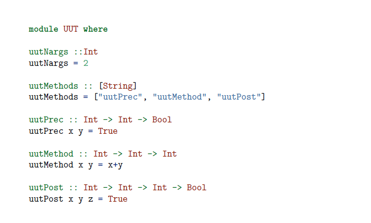
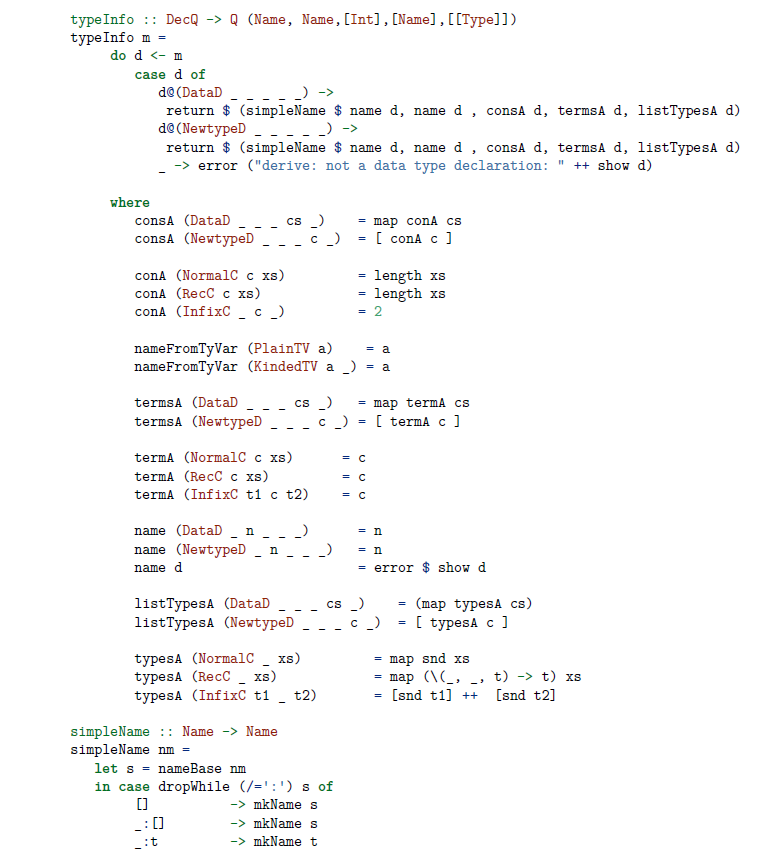
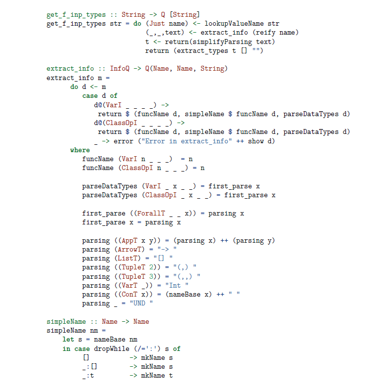
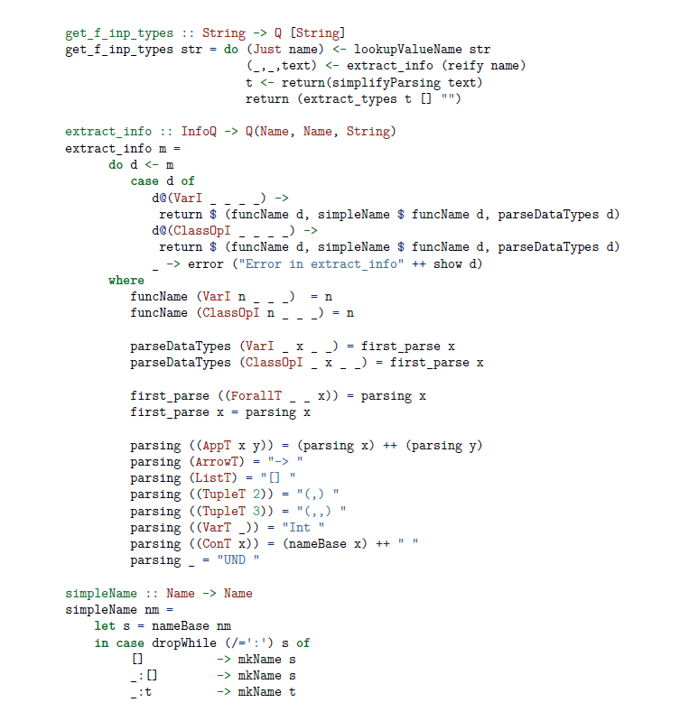
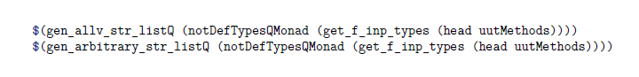
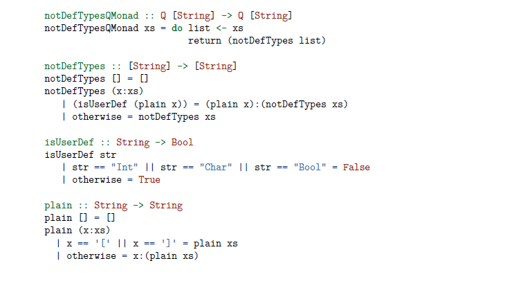
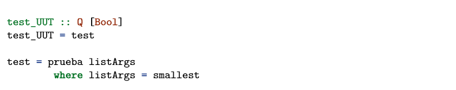
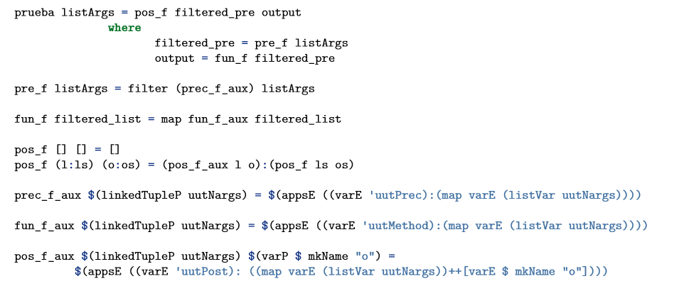
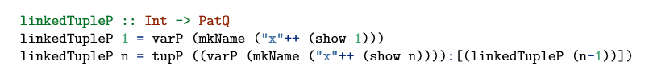

Resumen: 


Summary:

\pagebreak

# 1.a  Introducción
Una de las partes más costosas dentro del desarrollo de programas es el testeo, ya que requiere un gran esfuerzo humano para poder especificar los diferentes casos de prueba, lanzarlos y analizar los resultados. Ello provoca que en la mayoría de los casos los programas se prueben mucho menos a fondo de lo que sería necesario. Por ello, en los últimos años han sido desarrolladas diversas herramientas para automatizar de manera parcial dicho proceso de testeo, sin embargo la mayoría de ellas están especializadas en un único lenguaje de programación.

Nuestro objetivo es conseguir una plataforma que permita el testeo de aplicaciones de manera inmediata para el usuario y que admita como entrada un programa escrito en cualquier lenguaje de programación.

En el siguiente trabajo vamos a tratar la plataforma **CaseGenerator**, que se engloba dentro del proyecto CAVI-ART, siendo esta parte la encargada de generar los casos de prueba de manera automatizada, adaptándolos a las necesidades de cada ejecución. Este proyecto toma como base las ideas desarrolladas anteriormente por programas como Quickcheck, Korat o Smallcheck, pero intentando conseguir un programa final que sea más directo y fácil de usar, y a la vez compatible con diversos lenguajes de programación tanto funcionales como no funcionales. Para lograr el primer objetivo hemos eliminado la obligación de que el usuario defina un nuevo generador para cada uno de los nuevos tipos definidos. Así, será el propio programa el que realice la tarea de investigar estos tipos y deducir un generador de casos óptimo para cada uno de ellos. Para lograr el segundo en cambio hemos creado una Representación Intermedia (IR) a la que se traducen los programas antes de ser testeados y que permite escribir una plataforma independiente del lenguaje de programación.

A su vez profundizaremos en la estructura de clases de CaseGenerator y visualizaremos su código, de manera que queden claras todas las ideas detrás de su funcionamiento y las razones por las que decidimos utilizar algunas técnologías, como la librería **\texttt{Generics}** del compilador GHC y la extensión de Haskell llamada **\texttt{Template Haskell}**.

Por último, tras explicar el funcionamiento de la plataforma expondremos algunos ejemplos prácticos del funcionamiento del programa al ser ejecutado con funciones reales.

\pagebreak

# 2  Preliminares

### 2.1  CAVI-ART Project
En esta seccion explicamos el proyecto CAVI-ART, actualmente en fase de desarollo en la UCM y del cual forma parte mi TFG.

La plataforma **CAVI-ART** consiste en un conjunto de herramientas pensadas para ayudar al programador en la validacion de programas escritos en diferentes lenguajes. Estas ayudas incluyen la extracción automática y prueba de condiciones de verificación, la prueba automática de terminación (siempre que sea decidible usando la tecnología actual), la inferencia automática de algunos invariantes y la generación automática y ejecución de casos de prueba. [@caviart1; @caviart2; @caviart3]

Un aspecto clave de la plataforma es su Representación Intermedia de los programas (de aquí en adelante IR). Los programas escritos en lenguajes convencionales como C++, Java, Haskell, OCaml y otros, se traducen a la IR, sobre la que se realizan todas las actividades mencionadas anteriormente. La intencion es programar la mayor parte de la plataforma una sola vez, de manera que sea independiente del lenguaje de programación utilizado.

La IR se diseñó con la intención de facilitar al máximo posible las tareas nombradas con anterioridad tanto como fuera posible, mediante un diseño simple que cuenta con muy pocas construcciones primitivas. Nunca se pensó en la IR como código ejecutable sino como una sintaxis abstracta para facilitar el análisis estático y la verificación formal. Sin embargo en los últimos meses se decidió convertir la IR en código ejecutable, para posibilitar la ejecución de pruebas y construcción de herramientas de testeo, ambas independientes del lenguaje. Esto supone una ventaja ya que la mayoría de las herramientas de testeo existentes están ligadas a un lenguaje en concreto. 

La parte del proyecto encargada de traducir la IR a Haskell y hacer ejecutables los asertos se engloba dentro del trabajo de fin de grado de Marta Aracil Muñoz con título *Implementación de asertos ejecutables para una plataforma de verificación* que también se engloba dentro del proyecto CAVI-ART.


\pagebreak

A continuación pasamos a describir las tecnologías más importantes usadas en el desarrollo de nuestro programa.

### 2.2  QuickCheck

Quickcheck [@quickcheck] es una herramienta de Haskell pensada para probar funciones escritas en dicho lenguaje sobre un conjunto de casos de prueba generados de manera aleatoria. Dicho programa resultó ser de gran ayuda, pues tiene ideas similares a lo que queríamos conseguir con nuestro proyecto, ya que se trata también de un sistema de prueba tipo caja negra.
Sin embargo cuenta con  algunas diferencias, sobre todo en la generación de los casos de prueba, ya que Quickcheck los genera de manera aleatoria, mientras que nuestro proyecto los genera de manera exhaustiva.

##### Ejemplo de funcionamiento del programa

En este caso vamos a trabajar con la siguiente propiedad de las listas, cierta para cualquier lista finita.

```haskell
  prop_RevApp xs ys = 
    reverse (xs++ys) == reverse ys++reverse xs
```

Ahora lanzamos el programa Quickcheck para comprobar si supera todos los casos de prueba.
```haskell
  Main> QuickCheck prop_RevApp
  OK: passed 100 tests.
```
Veamos ahora que pasa en caso de que nuestra función no esté definida correctamente. 

```haskell
  prop_RevApp2 xs ys = 
    reverse (xs++ys) == reverse xs++reverse ys
```
Al ejecutar la nueva funcion desde Quickcheck.

```haskell
  Main> quickcheck prop_RevApp2
  Falsifiable, after 1 tests:
  [2]
  [-2,1]
```

Aquí podemos observar que en caso de fallo Quickcheck nos devuelve el contraejemplo de tamaño mínimo, lo que nos indica esta vez es que nuestra definición ha fallado en el primer test y que en dicho caso las respectivas listas para las que ha sido probado falso son [2] y [-2,1].

#####Leyes condicionales
En algunos casos las leyes que queremos definir no pueden ser representadas mediante una simple función y solo son ciertas bajo unas precondiciones muy concretas. Para dichos casos Quickcheck cuenta con el operador de implicación **\texttt{==>}** para representar dichas leyes condicionales.
Por ejemplo una ley tan simple como la siguiente:
```haskell
  x <= y ==> max x y == y
```
Puede ser representada mediante la siguiente definición.
```haskell
  prop_MaxLe :: Int -> Int -> Property
  prop_MaxLe x y = x <= y ==> max x y == y
```

En este ejemplo podemos observar que el resultado de la función es de tipo **\texttt{Property}** en vez de **\texttt{Boolean}**, lo cual es debido a que en el caso de las leyes condicionales en vez de probar la propiedad para 100 casos aleatorios, ésta es probada contra 100 casos que cumplan la precondición establecida. Si uno de los candidatos no la cumple será descartado y se considerará el siguiente. Quickcheck genera un máximo de 1000 casos de prueba y si entre ellos no se han encontrado al menos 100 que cumplan la precondición, simplemente informa al usuario cuantos la cumplen. Dicho límite está pensado para que en caso de que no existan más casos que cumplan dicha precondición el programa no busque indefinidamente.

#####Monitorizando los datos
Al testear propiedades debemos tener cuidado, pues quizás parezca que hemos probado una propiedad a fondo para estar seguros de su credibilidad pero esta simplemente sea aparente. Intentaremos ejemplificarlo usando la inserción en una lista ordenada.
```haskell
  prop_Insert :: Int -> [Int] -> Property
  prop_Insert x xs =
    ordered xs ==>
      classify (null xs) "trivial" $
        ordered (insert x xs)
```
Esto nos permite conocer cuantas de las pruebas se realizaron sobre una lista vacia. En cuyo caso la condición de **\texttt{ordered xs}** es trivial.
Si ejecutamos esta nueva función con Quickcheck obtendremos el siguiente mensaje.
```haskell
  Ok, passed 100 tests (43% trivial)
```
Es decir que el 43% de los tests realizados son sobre una lista vacia.

Pero a su vez Quickcheck nos ofrece la posibilidad de un mejor análisis, más allá de etiquetar uno de los casos que nos interese. Podemos realizar una especie de *histograma*, utilizando la palabra reservada **\texttt{collect}**, que nos dará una mayor información de la distribución de los casos de prueba, por ejemplo en este caso según su longitud.
```haskell
  prop_Insert :: Int -> [Int] -> Property
  prop_Insert x xs =
    ordered xs ==>
      collect (length xs) $
        ordered (insert x xs)
```
Al ejecutarlo obtendriamos un resultado como el siguiente, separado según los tamaños de las listas.
```haskell
  Ok, pased 100 tests.
  49% 0.
  32% 1.
  12% 2.
  4% 3.
  2% 4.
  1% 5.
```

######Como definir generadores
En primer lugar Quickcheck empieza definiendo la clase **\texttt{Arbitrary}** de la cual un tipo es una instancia si podemos generar casos aleatorios de él. La manera de generar los casos de prueba depende por supuesto del tipo.
```haskell
  class Arbitrary a where
    arbitrary :: Gen a
```

**\texttt{Gen}**  es un tipo abstracto representando el generador para el tipo **\texttt{a}**, que bien puede ser el generador por defecto o uno creado por el programador para el caso específico. El tipo abstracto **\texttt{Gen}** se define como:
```haskell
  newtype Gen a = Gen (Rand -> a)
```
En esta definición **\texttt{Rand}** es un número semilla aleatorio y un generador no es más que una función que puede crear una **\texttt{a}** de una manera pseudoaleatoria.

Ahora vamos a analizar las posibilidades que nos ofrece Quickcheck a la hora de definir los generadores de casos para los tipos de datos definidos por el usuario.

Supongamos que definimos el tipo **\texttt{Colour}** de la siguiente manera
```haskell
  data Coulour = Red | Blue | Green
```
Un ejemplo de un generador para dicho tipo en el cual los tres colores son equiprobables sería
```haskell
  instance Arbitrary Colour where
    arbitrary = oneof [return Red | return Blue | return Green]
```
en el cual podemos observar el funcionamiento de la función **\texttt{oneof}**, que se encarga de devolver uno de los elementos de la lista dando la misma probabilidad a todos ellos.

Vamos a observar otro ejemplo, en este caso un generador para listas de un tipo **\texttt{a}** arbitrario.
```haskell
  instance Arbitrary a => Arbitrary [a] where
    arbitrary = frequency
      [ (1, return [])
        (4, liftM2 (:) arbitrary arbitrary)]
```
En ella usamos la función **\texttt{frequency}** la cual funciona de manera similar a **\texttt{oneof}**, pero dándole pesos distintos a los diferentes casos. En este ejemplo le damos peso 1 a la lista vacia y peso 4 a la lista compuesta de otras 2 listas, con lo cual obtendremos 4 veces más casos de prueba de longitud 4 que listas vacias y de esta manera evitaremos el problema indicado anteriormente en el que la mayoría de los casos de prueba eran listas vacias.

### 2.3  Librería Generics de GHC

El siguiente punto a tratar en estos preliminares es la librería **\texttt{Generics}** del compilador GHC de Haskell [@generics], una librería utilizada principalmente para la generación automática de instancias de funciones correctas para cualquiera que sea el tipo de datos. En el caso de este proyecto **\texttt{Generics}** apareció como una librería necesaria para escribir nuestro programa de manera que funcionara para cualquier tipo de datos, incluídos los definidos por el usuario y de los cuales no podemos tener conocimiento por adelantado.

Dicha librería dentro de Haskell es posible por dos caracteristicas del propio lenguaje:

1. La existencia de las clases de tipos, que actúan como una interfaz de Java definiendo el comportamiento de las operaciones sobre los tipos que pertenecen a dicha clase.

2. Por la existencia del *polimorfismo de tipo Ad-hoc*. Este nos permite abstraer una operación sobre una o más clases de tipos simplemente con la condición de que el tipo concreto tenga unas propiedades como por ejemplo que sea ordenable (pertenezca a la clase **\texttt{Ord}**) o que sus elementos admitan comparaciones por igualdad (que pertenezca a la clase **\texttt{Eq}**).

En el caso de la librería **\texttt{Generics}**, ésta permite definir funciones genéricas para cualquiera que sea el tipo al que se apliquen ya que dicha definición se realiza sobre la estructura del tipo y teniendo en cuenta que todo tipo algebraico en Haskell utiliza un número pequeño de construcciones (uniones, productos cartesianos, recursión y tipos básicos).

En el caso de esta librería, la clase de tipos principal (**\texttt{Generic}**) expresa la posibilidad de describir un tipo de datos en términos de un conjunto simple de combinadores. Estos combinadores son:

- En primer lugar debemos definir el comportamiento deseado para los tipos de datos vacios (representados con **\texttt{V1}** en **\texttt{Generics}**)

- En segundo lugar debemos definir el comportamiento deseado para los tipos de datos cuyo constructor carece de parámetros (representados con **\texttt{U1}** en **\texttt{Generics}**).

- En tercer lugar se trata de definir el comportamiento para los tipos compuestos de acuerdo a como se forman. En Haskell los tipos compuestos solo pueden definirse mediante dos operaciones partiendo de los tipos básicos. Estas dos operaciones son la union disjunta y el producto de tipos (representados como \texttt{:+:} y \texttt{:*:} respectivamente en **\texttt{Generics}**). Deberemos establecer como queremos que sea el comportamiento de las funciones de nuestra clase genérica de acuerdo a como se forma nuestro tipo a partir de los tipos básicos.

- Por último están dos tipos para representar meta-información y etiquetado de tipos (representados respectivamente por **M1** y **K1**), que nos permitirán definir el comportamiento esperado para las funciones cuando esta depende de las etiquetas o parte de la meta-información del tipo.

Una vez definidas las funciones para estos cinco diferentes combinadores es necesario definir algunas instancias para los tipos predefinidos como **\texttt{Int}**, **\texttt{Char}**, **\texttt{Boolean}**... de manera que si el usuario crea un tipo complejo como por ejemplo un Diccionario con variables de tipo **\texttt{Int}** como clave y **\texttt{Char}**, como valores tengamos un punto de partida para construir mediante **\texttt{Generics}** las instancias en nuestra clase para los nuevos tipos de datos.

### 2.4  Template Haskell
En este apartado trataremos sobre **\texttt{Template Haskell}** [@template_haskell], una extensión sobre el lenguaje original que añade la posibilidad de realizar metaprogramación en Haskell, de una manera similar al sistema de *templates de C++*, de ahí su nombre, permitiendo a los programadores computar parte de la generación de código en tiempo de compilación dependiendo de las necesidades.

##### Un ejemplo de la idea básica
Imaginemos que escribimos una funcion para imprimir un valor en Haskell siguiendo el estilo de C. Nos gustaría poder escribir algo como esto en Haskell:
```haskell
    printf ”Error: %s on line %d.” msg line
```
El caso es que en Haskell uno no puede definir **\texttt{printf}** de una manera tan sencilla pues su tipo depende del valor de su primer argumento. En **\texttt{Template Haskell}** en cambio podemos definir **\texttt{printf}** de manera que sea eficiente y garantice la seguridad de tipos de Haskell.

```haskell
    $(printf ”Error: %s on line %d”) msg line
```
El símbolo $ indica "evaluar en tiempo de compilación". La llamada a la función **\texttt{printf}** devuelve a Haskell una expresión que es insertada en el lugar de la llamada, después de lo cual se puede realizar la compilación de la expresión. Por ejemplo el código entre paréntesis:

```haskell
    $(printf ”Error: %s on line %d”)
```
 lo traduce a la siguiente expresión lambda en Haskell
```haskell
    (\ s0 -> \ n1 -> ”Error: ” ++ s0 ++ ” on line ” ++ show n1)
```
Sobre la cual se realizará la comprobación de tipos y después se aplicará sobre **\texttt{msg}** y **\texttt{line}**

##### Como usar template Haskell

Lo primero que hay que resaltar es el hecho que las funciones de **\texttt{Template Haskell}** que son ejecutadas en tiempo de compilación están escritas en el mismo lenguaje que las funciones utilizadas en tiempo de ejecución. Una gran ventaja de esta aproximación es que todas las librerías existentes y las técnicas usadas en Haskell pueden ser utilizadas directamente en Template Haskell. Por otro lado, una de las posibles desventajas de esta aproximación es la necesidad de tener que utilizar notaciones como \texttt{$} o \texttt{[||]} (conocidas como *splicing* y *quasi-quotes* respectivamente) la primera de ellas traduce las expresiones en Template Haskell a expresiones Haskell y la otra realiza la traducción inversa.

En los ejemplos más sencillos, como el anteriormente presentado sobre como escribir una función **\texttt{printf}** en **\texttt{Template Haskell}** la notación del splicing o la quasi-quotation pueden resultar de gran ayuda. El problema es que tan pronto como empezamos a hacer cosas más complejas en meta-programación esta notación deja de ser suficiente. Por ejemplo no es posible definir una función para seleccionar el i-ésimo elemento de una tupla de n elementos usando solo esas dos notaciones. Dicha función en **\texttt{Template Haskell}** sería asi.

```haskell
    sel :: Int -> Int -> ExpQ
    sel i n = [| \x -> $(caseE [| x |] [alt]) |]
        where alt :: Match
              alt = simpleM pat rhs

              pat :: PatQ
              pat = ptup (map pvar as)

              rhs :: ExpQ
              rhs = var (as !! (i-1))

              as :: [String]
              as = ["a" ++ show i | i <- [1..n]]
```

Para explicar un poco este código vamos a empezar de abajo a arriba, con el fin de entender las partes que usaremos despues en la función principal **\texttt{sel}**.
En primer lugar el cometido de **\texttt{as}** es crear una lista de nombres de aes desde **\texttt{a1}** hasta **\texttt{an}**. La segunda de ellas, **\texttt{rhs}** se encarga de coger el i-esimo elemento de la lista de aes y devolverlo como una variable de tipo **\texttt{ExpQ}** que es el tipo utilizado en **\texttt{Template Haskell}** para las expresiones. La función **\texttt{pat}** transforma en primer lugar la lista de **\texttt{String}** en una lista de variables de tipo **\texttt{PatQ}** que es el utilizado en **\texttt{TH}** para referirse a los patrones y después junta dicha lista en una tupla de tipo **\texttt{PatQ}**. Después realiza un emparejamiento de la tupla tipo **\texttt{PatQ}** con el **\texttt{rhs}** mediante la función **\texttt{simpleM}** (simple Match).
Finalmente, la función **\texttt{caseE}** que toma como parámetros una variable x (de tipo **\texttt{ExpQ}** como indica la quasi-quotation alrededor de x) y el emparejamiento devuelto por **\texttt{alt}**, realizando la sustituición de la **\texttt{x}** al lado izquierdo de la flecha por el patrón correspondiente y colocando al lado izquierdo de la flecha la **\texttt{ExpQ}** devuelta por **\texttt{rhs}**, que es el elemento tomado de la tupla.

Esta función se traduciria a una expresión lambda que realizando la llamada **\texttt{sel 4 6}** es decir seleccionar el cuarto elemento de una tupla de 6 tendría esta forma
```haskell
    (\(a1,a2,a3,a4,a5,a6) -> a4)
```

##### Reification (Cosificación)
La *reification* es una facilidad de **\texttt{Template Haskell}** que permite al programador preguntar sobre el estado de la tabla de símbolos que guarda el compilador. Por ejemplo se puede escribir un código como el siguiente:

```haskell
  module M where
  data T a = Tip a | Fork (T a) (T a)
  
    repT :: Decl
    repT = reifyDecl T

    lengthType :: Type
    lengthType = reifyType length

    percentFixity :: Q Int
    percentFixity = reifyFixity (%)

    here :: Q String
    here = reifyLocn
```

La primera de las funciones declaradas devuelve un resultado de tipo **\texttt{Decl}** (equivalente a **\texttt{Q Dec}**), representando la declaración del tipo **\texttt{T}**. El siguiente cómputo **\texttt{reifyType length}** devuelve un resultado de tipo **\texttt{Type}** (equivalente a **\texttt{Q Typ}**) representando el conocimiento del compilador sobre el tipo de la función **\texttt{length}**.
En tercer lugar **\texttt{reifyFixity}** devuelve la *fixity* de los argumentos de la función lo cual resulta muy útil cuando se quiere deducir como imprimir algo. Finalmente **\texttt{reifyLocn}** devuelve un resultado de tipo **\texttt{Q String}**, que representa la posición en el código fuente desde donde se ejecutó **\texttt{reifyLocn}**.

De esta manera la *reification* devuelve un resultado que puede ser analizado y utilizado en otros cálculos, pero hay que recordar, que al tratarse de una herramienta del lenguaje para acceder a la tabla de símbolos y estar encapsulado dentro de la mónada **\texttt{Q}**, no puede ser usada como una función, por ejemplo con la función map (**\texttt{map reifyType xs}** sería incorrrecto).

\pagebreak

# 3  Nuestra propuesta: las clases Allv, Sized y Arbitrary

### 3.1  Black box testing en nuestro contexto

En el mundo del testing existen dos grandes posibilidades: sistemas de tipo caja negra y sistemas de tipo caja blanca. Los de caja negra son aquellos sistemas de testing que no se basan en la estructura interna, si no que trabajan únicamente con la entrada, sobre la que aplican una precondición, y la salida sobre la que comprueban si cumple las postcondiciones establecidas. 
En cambio los de caja blanca no testean únicamente las entradas y salidas del programa aplicandoles precondiciones y comprobando la postcondiciones, sino que además se basan en la estructura interna del programa para realizar la generación de casos de prueba, de forma que se cubra todo el texto del programa. Según el criterio de cobertura deseado se pueden generar casos para ejercitar todas las condiciones o todas las ramas o todos los caminos.

En el caso de nuestro proyecto nos decidimos por el método de caja negra, pues queríamos conseguir un sistema válido para poder probar cualquier programa sin necesidad de tener que volver a generar los casos de prueba cuando cambia la estructura interna del programa. Esa es una de las desventajas del testeo de tipo caja blanca, que para poder comprobar partes de la estructura interna de un programa tendríamos que adaptar la plataforma para cada uno de los nuevos programas.

La idea principal detrás de nuestro proyecto era principalmente la inmediatez y la comodidad del usuario, es decir que para probar un programa no fuera necesario escribir código extra, aparte del ya existente programa, sino que solo fuera especificar como quiere que se generen los casos de prueba y los rangos de los dominios a usar y con eso sea ya capaz de probar su programa, lo cual se ajusta mucho más a la idea de testeo de caja negra.

Las posibles maneras en las que el usuario puede especificar como se generan los casos de prueba para cada argumento son 3:

- Generar *n* casos de prueba de manera aleatoria.

- Coger *n* casos de prueba de tamaño menor o igual a *m*.

- Coger los *n* primeros casos de prueba de la lista de todos los valores, sea cual sea su tamaño.

### 3.2  Sized

En la estructura del proyecto, **\texttt{Sized}** está pensada como la clase externa que hereda de **\texttt{Allv}**. Su código se muestra en la figura 2. A su vez es la clase que se ocupa de devolver la lista de los casos de prueba a partir de la lista **\texttt{allv}** de todos los valores de un tipo de datos. Esto se realiza mediante dos funciones:

- **\texttt{sized}** que devuelve los *n* primeros casos menores o iguales a un tamaño *m*.

- **\texttt{smallest}** que devuelve  los *n* primeros casos de la lista **\texttt{allv}** según su posición y sin importar su tamaño.

En esta clase del proyecto decidimos implementar el concepto de tamaño de un elemento mediante la librería **\texttt{Generics}** explicada anteriormente, pues de esa manera podríamos tener una representación del tamaño independiente del tipo y no hay que definirlo para cada tipo nuevo creado por el usuario. (Fig 2)

En primer lugar debemos definir la clase externa de la parte de **\texttt{Generics}** que será la que nosotros usemos. En ella, sólo debemos definir las funciones que queremos que tenga y como se comunica con la clases internas de **\texttt{Generics}**. Primero definimos la funcion en si, que dada un elemento de un tipo cualquiera nos devuelva un entero que representará su tamaño.

Después debemos definir como se comunica la función **\texttt{size}** externa con la versión genérica **\texttt{gsize}** para obtener de esta el valor a devolver. En este caso usamos la función **\texttt{from}** recibe un valor en su representación no genérica y lo transforma a su representación genérica para que pueda ser manipulado en las diferentes funciones. En este caso es simple pues el valor del tamaño obtenido por **\texttt{gsize}** será el mismo devuelto por nuestra función **\texttt{size}**. Finalmente creamos la clase interna **\texttt{GSized}** y definimos la función **\texttt{gsize}**.

Una vez tenemos la interfaz entre las dos clases **\texttt{Sized}** y **\texttt{GSized}** lo siguiente que debemos definir es el constructor sin argumentos, que en nuestro caso devuelve el tamaño 0. A continuacion definimos **\texttt{size}** para un tipo compuesto por otros dos, el tamaño de dicho tipo es la suma de los tamaños de los tipos que los componen. Tras ello definimos el comportamiento cuando el tipo tiene mas de un constructor posible, en este caso si elegimos el constructor de la derecha el tamaño del tipo será el del tipo de la derecha y similar si elegimos el constructor de la izquierda. Por último, tenemos la instancia utilizada para trabajar con la metainformación del tipo, que en nuestro caso al no ser necesaria dicha información simplemente llamamos de nuevo a la funcion **\texttt{gsize}** ignorando la metainformación.


\pagebreak

### 3.3  Allv/TemplateAllv

En primer lugar vamos a tratar la clase **\texttt{Allv}**, cuyas instancias cuentan unicamente con una función, **\texttt{allv}** la cual devuelve la lista de todos los posibles valores del tipo de datos. 

Al principio esta clase estaba pensada para ser una única clase que utilizara la librería **\texttt{Generics}** y para contar con un método, **\texttt{compose}** con el cual ser capaces de generar instancias de la clase **\texttt{Allv}** para los tipos definidos por el usuario. Dicha función se encargaría de crear la lista de todos los valores (**\texttt{allv}**) para el nuevo tipo de datos a partir de las listas de los tipos predefinidos, pero a la hora de integrarlo con la clase **\texttt{Sized}** encontramos un problema . La idea que teníamos sobre esta clase era darle al usuario la posibilidad de pedir los *n* valores mas pequeños de una clase o los *n* primeros valores de tamaño menor o igual a un número prefijado por él.
Lo cual entraba en conflicto con la manera en la que generábamos las listas de **\texttt{allv}** para los tipos definidos por el usuario.(Figura x)

Dadas dos listas la idea es realizar el producto cartesiano de ellas siendo este el resultado de generar todas las parejas con un valor de la primera lista y otro de la segunda. Teniendo en cuenta que ambas pueden ser infinitas, dicho producto deberá ser realizado por diagonales.
La combinación de listas infinitas podía ser realizada sin problemas usando **\texttt{Generics}**, pero el problema llegaba a la hora de querer devolver los *n* primeros valores de un tamaño menor o igual a *m*, ya que para ello debíamos ordenar la lista infinita y encontramos el problema de que en dichas listas infinitas el número de elementos de un tamaño siempre eran infinito y que siempre habría algún elemento más de tamaño menor o igual a *m*, aunque estuviera después de muchos elementos intermedios que no lo fueran. Este problema nos hizo pensar en utilizar **\texttt{Template Haskell}** en lugar de **\texttt{Generics}**.

En la versión definitiva del programa en la clase **\texttt{TemplateAllv}** se encuentra esta funcionalidad de crear una instancia de **\texttt{Allv}** para los tipos de datos definidos por el usuario, utilizando para ello **\texttt{gen\_allv}**, con la ayuda de la ya nombrada función **\texttt{compose}**(Fig 4) que tiene la siguiente forma.

La función **\texttt{compose}** se encarga de concatenar todas las diagonales en una única lista final, que es la que se devuelve mediante la función **\texttt{allv}**, por otro lado **\texttt{diags}** se encarga de crear una de las diagonales y mientras no sea la última volver a llamarse a sí misma con los parámetros para la siguiente. Los parámetros de la función **\texttt{diags}** son:

- **\texttt{i}** se trata del ordinal de la diagonal que vamos a generar.

- **\texttt{xs}** e **\texttt{ys}** se tratan de las dos listas que vamos a combinar.

Además, dentro de **\texttt{TemplateAllv}** existen tres funciones que se encargan de crear una instancia adecuada de la clase **\texttt{Allv}** para cada uno de los tipos de datos definidos por el usuario.

La primera de ellas, y la más externa en dicho proceso es **\texttt{gen\_allv}**(Fig 3), la cual además de llamar a **\texttt{typeInfo}** para extraer la información del tipo y pasarsela a las subfunciones, es también en la que se define, dentro de **\texttt{gen\_body}**, como se formará exactamente la nueva función **\texttt{allv}** para la instancia del tipo.

A continuación vamos a analizar con más profundidad la función **\texttt{gen\_body}** dentro de la cláusula **\texttt{where}** y el tipo de comprobaciones y análisis sobre el tipo que se realiza. En primer lugar indicar lo que significa cada una de las tres listas que recibe como parámetro dicha función:

- La primera de ellas contiene los números de parámetros de cada uno de los diferentes constructores.

- La segunda contiene los nombres de los diferentes constructores.

- La tercera una lista de nombres de *f's* entre *f~1~* y *f~n~* siendo *n* el número de constructores distintos para el tipo de datos.

La función **\texttt{gen\_body}** se encarga de analizar el número de parámetros de cada uno de los constructores, ya que si cuenta con un único parámetro se puede utilizar el nombre del propio constructor sin ningún problema, pero en caso de tener más de un parámetro, debido a que compose devuelve la lista compuesta como una lista de tuplas, es necesario utilizar una función auxiliar **\texttt{f}** para realizar la aplicación del constructor sobre los elementos de la tupla en lugar de sobre la propia tupla.
Aparte de esto **\texttt{gen\_body}** se encarga de conseguir juntar todas las partes que fueron preprocesadas en **\texttt{gen\_clause}** utilizando **\texttt{Template Haskell}**.

La siguiente función a tratar, **\texttt{gen\_instance}** (Fig 5) se encarga de crear una instancia de la clase **\texttt{Allv}** para el nuevo tipo de datos (parámetro **\texttt{for\_type}**) y adjuntar a dicha instancia la definición de la función **\texttt{allv}** que se crea en **\texttt{gen\_clause}**.


Por último tenemos la función **\texttt{gen\_clause}** (Fig 6) que es responsable de crear la definición de la función **\texttt{allv}** para el tipo de datos, usando para ello la función **\texttt{gen\_body}** que había sido definida anteriormente en **\texttt{gen\_allv}**.
Además, cuenta con una serie de funciones auxiliares que realizan parte del procesamiento:

- **\texttt{listOfFOut}** se encarga de crear la lista de nombres de variables entre *f~1~* y *f~n~* para aquellos casos en los cuales los constructores tienen más de un parámetro.

- **\texttt{isRec}** devuelve una lista de booleanos en la cual cada posición indica si el constructor en dicha posición es recursivo o no.

- **\texttt{reorderL}** sirve para reordenar los constructores (lo cual es equivalente a las listas con la información por cada constructor) de manera que queden en primer lugar aquellos que no son recursivo y al final los que si lo son. Esto es necesario, ya que los constructores recursivos harán uso de aquellos que no lo son y por ello los no recursivos deben definirse en primer lugar.

- **\texttt{gen\_wheres}** que es responsable
 de definir las clausulas where necesarias para todos aquellos constructores con más de un parámetro que necesiten utilizar una función auxiliar (que son las representadas por las *f's*).

- **\texttt{tupleParam}** crea las tuplas de parámetros para cada una de las funciones auxiliares **\texttt{f}**.




\pagebreak

### 3.5  Instancias predefinidas
En este último apartado vamos a repasar las instancias dentro de las clases **\texttt{Sized}** y **\texttt{Allv}** para los tres tipos básicos (**\texttt{Int}**, **\texttt{Char}**y **\texttt{Bool}**) y para los tipos que se deducen directamente de ellos, como es el caso de listas de cualquier tipo ya instanciado en dichas clases o las tuplas de hasta longitud 6.

Adjunto el código donde se instancian dichos tipos en las dos clases que se encuentran en el módulo **\texttt{Sized}**.
```haskell
  instance Sized Int where
    size x = 1

  instance Allv Int where
    allv = [1..100]

  instance Sized Char where
    size x = 1

  instance Allv Char where
    allv = ['a'..'z']

  instance Sized Bool where
    size x = 1

  instance Allv Bool where
     allv = [True, False]
```

Como podemos observar en el caso de la instancia en la clase **\texttt{Sized}**, cualquier elemento de uno de los tres tipos tendrá tamaño uno. En el caso de las instancias de los tres tipos en la clase **\texttt{Allv}**, simplemente debemos indicar el conjunto de valores de dicha clase que serán elegibles a la hora de generar casos de prueba.

A continuación mostramos las instancias para las listas y las tuplas de tipos ya definidos en **\texttt{Allv}**.

/////Añadir lista

```haskell
  instance Allv a => Allv [a] where
     allv = [] : map (\(x,xs) -> x:xs) $ compose (allv::a) (allv::[a])

  instance (Allv a, Allv b) => Allv (a,b) where
     allv = compose allv allv

  instance (Allv a, Allv b, Allv c) => Allv (a,(b,c)) where
     allv = compose allv (compose allv allv)

  instance (Allv a, Allv b, Allv c, Allv d) => Allv (a,(b,(c,d))) where
     allv = compose allv (compose allv (compose allv allv))

  instance (Allv a, Allv b, Allv c, Allv d, Allv e) => Allv (a,(b,(c,(d,e)))) where
     allv = compose allv (compose allv (compose allv (compose allv allv)))

  instance (Allv a, Allv b, Allv c, Allv d, Allv e, Allv f) => Allv (a,(b,(c,(d,(e,f))))) where
     allv = compose allv (compose allv (compose allv (compose allv (compose allv allv))))
```
Para las cuales utilizamos la función de **\texttt{compose}** explicada con anterioridad.

En el caso de las instancias derivadas dentro de la clase **\texttt{Sized}** éstas se generan mediante **\texttt{Generics}**.

También habíamos pensado incluir dentro del módulo **\texttt{Arbitrary}** las instancias de estos tres tipos y las derivadas a partir de ellos para la clase **\texttt{Arbitrary}**, pero por falta de tiempo decidimos centrarnos en la parte de **\texttt{Sized}**.

\pagebreak

# 4  El generador de casos

### 4.1  La interfaz con la UUT
La interfaz de nuestro programa con la unidad bajo testeo (a partir de ahora UUT siglas correspondientes *Unit Under Testing*) se encuentra dentro del módulo **\texttt{UUT}** (Figura x), dicho módulo es diferente para cada función a probar y contiene la información mínima necesaria para poder hacer todas las pruebas. Además, es generado automáticamente para cada función que vayamos a probar mediante la aplicación de CAVI-ART *IR2Haskell*, que se encarga de traducir la representación de la IR a código Haskell.
La información presente en la **\texttt{UUT}** es:

- En primer lugar una función **\texttt{uutNargs}**, que devuelve un entero y que indica el número de argumentos de la función que vamos a probar.

- En segundo lugar **\texttt{uutMethods}**, que contiene los nombres de las tres funciones que utilizaremos en el proceso (precondición, función y postcondición).

-A continuación la precondición en este caso **\texttt{uutPrec}**, la función **\texttt{uutMethod}** y postcondición **\texttt{uutPost}**. Estas tres funciones serán las que guien todo el proceso de prueba de la función para la lista de casos generados.



\pagebreak

### 4.2  La obtención del tipo de la UUT
Una de las partes más importantes dentro del programa, y la principal causa por la que **\texttt{Template Haskell}** resultó de gran utilidad para el proyecto, es su facultad para analizar los tipos de las funciones y adaptar el generador de casos a ellos, tanto si son tipos predefinidos, como si son definidos por el usuario.

Dentro de **\texttt{TemplateAllv}** se encuentra la funcion  **\texttt{typeInfo}** (Figura x)  que cuyo papel es extraer y sintetizar la información sobre un tipo declarado por el usuario. Esta función recibe como parámetro una variable del tipo **\texttt{DecQ}** y devuelve una tupla dentro de la monada **\texttt{Q}** con la siguiente información:

- En primer lugar el nombre simplificado del tipo del cual vamos a realizar la instancia, considerado simplificado a quitar toda la parte del nombre que se refiere a la estructura de módulos de la cual se hereda dicho tipo. Por ejemplo si crearamos una instacia para el tipo **\texttt{Integer}** del módulo **\texttt{Prelude}** el nombre del tipo sin simplificar sería **\texttt{Prelude.Integer}** y una vez simplificado simplemente **\texttt{Integer}**. Dicho nombre se trata de una variable de tipo **\texttt{Name}**, que es la manera en la que se maneja el tipo **\texttt{String}** en **\texttt{TH}** para los nombres.

- El segundo es el nombre del tipo sin simplificar, devuelto también como una variable de tipo **\texttt{Name}**.

- El tercero es una lista de enteros para cada uno de los diferentes constructores del tipo. Los enteros expresan el número de argumentos de cada uno de los constructores.

- El cuarto es una lista con los diferentes nombres de los constructores de tipo, siendo una lista de tipo **\texttt{Name}**

- El último es una lista de listas. Las listas internas contiene los tipos para uno de los constructores del tipo.


A la hora de crear los casos de prueba necesitamos analizar el tipo de las funciones, de lo que se encarga la función **\texttt{get\_f\_inp\_types}**, la cual dada una **\texttt{String}**, que será el nombre de una función, nos devuelve una lista con los tipos de entrada de dicha función en forma de lista de **\texttt{Strings}**.
Esta funcion consta de 4 pasos o llamadas a otras funciones auxiliares (Figuras x y x+1):

- En primer lugar **\texttt{lookupValueName}**, que es una funcion de la libreria **\texttt{Template Haskell}**, que dada una **\texttt{String}** como entrada, que será el nombre de una funcion, nos devuelve el **\texttt{Name}** asociado a ella dentro del namespace actual.

- La segunda función es **\texttt{extract\_info}**, la cual recibe como entrada un parámetro de tipo **\texttt{InfoQ}**, el cual se usa dentro de **\texttt{Template Haskell}** para encapsular información, como en este caso la información devuelta por el **\texttt{reify}** del **\texttt{Name}** de la función. A partir de ello **\texttt{extract\_info}** nos devolverá el nombre de la funcion sin el prefijo del módulo, el nombre de la función con el prefijo y, por último, el tipo de la función en forma prefija.

- En tercer lugar **\texttt{simplifyParsing}** que recibe como entrada el tipo de una función en forma prefija y lo transforma a forma infija, que es la manera en el que indicamos el tipo de la función, cuando lo ponemos explícitamente en Haskell.

- Finalmente la función **\texttt{extract\_types}** se encarga de transformar el tipo de la función en forma infija a una lista con los tipos de entrada de la misma, ignorando el tipo de salida.







\pagebreak

### 4.3  La generación de instancias de Allv y Arbitrary
Tras obtener la lista de tipos de datos que se utilizan en la función no definidos por defecto (lo cual corresponde con la segunda parte del apartado anterior) deberemos crear instancias en las dos clases **\texttt{Allv}** y **\texttt{Arbitrary}** para dichos tipos. La generación de instancias se realiza mediante **\texttt{Template Haskell}** dentro de la clase **\texttt{UUTReader}** (Figura x))

En nuestro código realizamos una llamada a las funciones **\texttt{gen\_allv\_str\_list}** y **\texttt{gen\_arbitrary\_str\_listQ}** de las clases **\texttt{TemplateAllv}** y **\texttt{TemplateArbitrary}**, respectivamente. Ambas funciones reciben como párametro una lista de **\texttt{Strings}** que contiene todos los nombres de los tipos definidos por el usuario y a partir de ella crean instancias para cada uno en la clase a la que está dirigida cada función. (**\texttt{Allv}** y **\texttt{Arbitrary}**)

La lista de tipos definidos por el usuario se calcula, hayando en primer lugar los tipos de los datos de la precondición y posteriormente, sobre dicha lista de tipos de entrada, aplicando la función **\texttt{notDefTypesQMonad}**, que filtra cuales de ellos no son instancias predefinidas.(Figura x).

Analizando dicha función y sus auxiliares podemos observar que son funciones relativamente simples, ya que **\texttt{notDefTypesQMonad}** se encarga de simplemente de lidiar con la mónada Q y pasar la lista fuera de la mónada a **\texttt{notDefTypes}**. En segundo lugar **\texttt{notDefTypes}** simplifica dichos tipos y se los pasa uno a uno a **\texttt{isUserDef}**, lo cual supone tratar igual las listas de un tipo que el tipo, ya que si las instancias para un tipo están definidas en las instancias base también lo estarán para las listas de dicho tipo. Por último, **\texttt{isUserDef}** se encarga simplemente de determinar si el tipo simplificado es **\texttt{Int}**, **\texttt{Char}** o **\texttt{Boolean}**, que son los tres que cuentan con instancia predefinida y si no coincide con ninguno de ellos devolverá **\texttt{True}**, al tratarse de un tipo definido por el usuario.





\pagebreak

### 4.4  La generación y ejecución de casos
La ejecución de los casos de prueba se realiza a través de la función **\texttt{test\_UUT}** que se encarga simplemente de llamar a **\texttt{test}**.

Desde **\texttt{test}** llamaremos a la función **\texttt{prueba}** sobre el conjunto de casos, que en esta versión se generará siempre mediante la función **\texttt{smallest}**, llamada dentro de la cláusula where de **\texttt{test}**. Al haber creado previamente las instancias de las clases **\texttt{Allv}** y **\texttt{Arbitrary}** para todos los tipos definidos por el usuario sabemos que esta llamada será posible independientemente el tipo de los datos (Figura x).

Tras esto expondremos la función **\texttt{prueba}** y a sus funciones auxiliares.
 
 La función **\texttt{prueba}** recibe como parámetro la lista de todos los casos de prueba generados y devuelve una lista de booleanos que indica cuales de ellos pasaron la postcondición y cuales no. Para ello en un primer lugar filtra los casos para ver los que cumplen la precondición establecida usando **\texttt{filtered\_pre}** y aplica la funcion **\texttt{output}** sobre los que pasaron la precondición para saber las salidas correspondientes a dichas entradas. Tras ello, llama a la función **\texttt{pos\_f}**, utilizando como parámetros los resultados de las dos anteriores para calcular la lista de los casos que, habiendo pasado la precondición, también cumplen la postcondición. (Figura x)
 
 A su vez tenemos tres funciones auxiliares de **\texttt{prueba}** que son: **\texttt{pre\_f}**, **\texttt{fun\_f}** y **\texttt{pos\_f}**, que se encargarán respectivamente de llamar a la precondición, la función y la postcondición bajo prueba. (Figura x)

 - La primera, **\texttt{pre\_f}** es un **\texttt{filter}** que actua sobre todos los casos de prueba utilizando para ello la función **\texttt{prec\_f\_aux}** que se explicará más adelante.

- La segunda, **\texttt{fun\_f}** se encarga de mapear la función **\texttt{fun\_f\_aux}** sobre cada uno de los casos de prueba para conseguir la lista de outputs. Dicha función auxiliar tambien se explicará posteriormente.

- La tercera **\texttt{pos\_f}** llama a la función **\texttt{pos\_f\_aux}** sobre dos valores, el primero de ellos un input de la lista de casos de prueba que cumplen la precondición y el segundo el output obtenido al ejecutar la función con dicho input, que nos devolverá un booleano indicando si dicho caso cumple o no la postcondición. La función **\texttt{pos\_f}** también será explicada a continuación.

Las tres funciones nombradas **\texttt{prec\_f\_aux}**, **\texttt{fun\_f\_aux}** y **\texttt{pos\_f\_aux}** (Figura x) están construidas utilizando **\texttt{Template Haskell}**, ya que deben de adaptarse al número de parámetros que tenga la función bajo prueba. Podemos observar que en el caso de las dos primeras su único parámetro es el siguiente splice, **\texttt{\$(linkedTupleP uutNargs)}** el cual representa un patrón de una tupla de tamaño variable, dependiendete del número de argumentos que tenga la función bajo prueba. La tercera función cuenta ademas con un segundo parámetro **\texttt{$(varP $ mkName "o")}** que será siempre un elemento único y el output correspondiente a la tupla de su primer parámetro

Las dos primeras se ocupan simplemente de aplicar respectivamente las funciones **\texttt{uutPrec}** y **\texttt{uutMethod}** sobre todos los parámetros que reciben encapsulados dentro de la tupla. La tercera aplica la función **\texttt{uutPost}** sobre todos los parámetros que recibe encapsulados en la tupla y también sobre su segundo parámetro (correspondiente al output).

Por último explicaremos la función auxiliar **\texttt{linkedTupleP}** (Figura x). Ésta se encarga de recibir un entero, que se trata de el número de parámetros, y generar un patrón que sea una tupla de ese mismo tamaño (Devuelve un PatQ pues es la manera de representar los patrones en Template Haskell).







\pagebreak

# 5  Experimentos

\pagebreak

# 6  Related

### 6.1  Korat

La primera de las herramientas que vamos a tratar en este apartado es **Korat** [@korat], una herramienta de Java que sirve para la generación de casos complejos de prueba a partir de unas restricciones dadas.

La idea detrás de **Korat** es que dado un predicado en Java y una función **\texttt{finitialization}** en la cual definimos los dominios para cada una de las clases del input, es decir los valores válidos para cada una de ellas, explora el espacio de estados de las posibles soluciones generando sólo soluciones no-isomorficas entre si, de esta manera consigue una gran poda de las soluciones no interesantes del espacio de búsqueda.

Lo primero que hace **Korat** es reservar el espacio necesario para los objetos especificados, en el caso de un **\texttt{BinTree}** reservaria espacio para él y para el número de Nodos que queramos. Por ejemplo, si queremos un arbol con tres nodos el vector contendría 8 campos:

- 2 para el **\texttt{BinTree}** (uno para la raíz y otro para el tamaño).

- 2 campos por cada uno de los 3 nodos (hijo izquierdo/hijo derecho).

Cada uno de los posibles candidatos que considere **Korat** a partir de ese momento será una evaluación de esos 8 campos. Por lo tanto el espacio de estados de búsqueda del input consiste en todas las posibles combinaciones de esos campos, donde cada uno de ellos toma valores de su dominio definido en **\texttt{finitialization}**


Para conseguir explorar de manera sistemática y completa el espacio de estados, **Korat** ordena todos los elementos en los dominios de las clases y los dominios de los campos. Dicho orden dentro de cada uno de los dominios de los campos será consistente con el del dominio de la clase y todos los valores que pertenezcan al mismo dominio de clase ocurriran de manera consecutiva en el dominio del campo. Tras esto, cada candidato de la entrada se respresenta como un vector de índices de sus correspondientes dominios de campos.

Tras definir los dominios de cada uno de los campos del vector comienza la busqueda con la inicialización a 0 de todos los indices del vector. A continuación fijamos los valores de los campos para cada posible candidato de acuerdo a los valores en el vector y acto seguido invoca a la funcion **\texttt{repOk}** que es donde el usuario ha definido la precondición. Durante dicha ejecución **Korat** monitoriza el orden en que son accedidos los campos del vector y construye una lista con los identificadores de los campos, ordenados por la primera vez en que **\texttt{repOk}** los accede.

Cuando **\texttt{repOk}** retorna **Korat** genera el siguiente candidato incrementando el índice del dominio de campo para el campo que se encuentra último en la lista ordenada construida previamente. Si dicho índice es mayor que el tamaño del dominio de su campo, este se pone a cero y se incrementa el índice de la posición anterior y así sucesivamente. Al seguir este método para generar el siguiente candidato conseguiremos podar un gran número de ellos que tienen la misma evaluación parcial sin dejar fuera ninguno válido.

El algoritmo de busqueda descrito aquí genera las entradas en orden lexicográfico. Además, para los casos en los que **\texttt{repOk}** no es determinista, este método garantiza que son generados todos los candidatos para los que **\texttt{repOk}** devuelve True. Los casos para los que siempre devuelve False nunca son generados y los casos para los que alguna vez se devuelve True y otras veces False pueden ser generados o no.

Dos candidatos serán definidos como isomorfos si las partes de sus grafos alcanzables desde la raíz son isomorfas. En el caso de **\texttt{repOk}** el objeto raíz es aquel pasado como argumento implícito.

El isomorfismo entre candidatos divide el espacio de estados en particiones isomórficas (debido al ordenamiento lexicográfico introducido por el orden de los valores de los dominios de los campos y la ordenación de los campos realizado por **\texttt{repOk}**). Para cada una de dichas particiones isomomorficas **Korat** genera únicamente el candidato lexicográficamente menor.

Además, con el proceso explicado anteriormente para generar el siguiente candidato, teniendo en cuenta la lista de ordenación de los campos, **Korat** se asegura de no generar varios candidatos dentro de la misma partición isomórfica.

### 6.2  Smallcheck

La segunda herramienta a tratar en este apartado es **\texttt{Smallcheck}** [@smallcheck] una librería para Haskell usada en el testing basado en propiedades. Esta librería parte de las ideas del **\texttt{Quickcheck}** y perfecciona algunos de los puntos flacos de este.

La principal diferencia de **\texttt{Smallcheck}** respecto a **\texttt{Quickcheck}** es la forma en que genera sus casos de prueba. En este caso **\texttt{Smallcheck}** se apoya en la "hipótesis del ámbito pequeño" la cual dice que si un programa no cumple su especificación en alguno de sus casos casi siempre existirá un caso simple en el cual no la cumpla o lo que viene a ser lo mismo, que si un programa no falla en casos pequeños lo normal es que no falle en ninguno de sus casos.

Partiendo de esta idea cambia la generación existente en **\texttt{Quickcheck}**, que era aleatoria, por una generación exhaustiva de todos los casos de prueba pequeños, ordenados por *profundidad* (que es el nombre usado para el tamaño), dejando a criterio del usuario hasta que profundidad deben considerarse como pequeños. A continuación presentaremos como están definidas las profundidades más importantes:

- En el caso de los tipos de datos algebraicos, como es usual, la profundidad de una construcción de aridad cero es cero mientras que la profundidad de una construcción de aridad positiva es una más que la mayor de todos sus argumentos.

- En el caso de las tuplas, dicha profundidad se define de manera un poco diferente. La profundidad de una tupla de aridad cero es cero pero la de una tupla de aridad positiva es la mayor profundidad de entre todas las de sus componentes.

- En el caso de los tipos numéricos, la definición de la profundidad se realiza con respecto a una representación imaginaria como una estructura de datos. De esta manera, la profundidad de un entero *i* será su valor absoluto, ya que se construyó de manera algebraica como **Succ^i^ Zero**. A su vez, la profundidad de un numero decimal **s x 2^e^** es la de la tupla de enteros (s,e).

**\texttt{Smallcheck}** define una clase **\texttt{Serial}** de tipos que pueden ser enumerados hasta una determinada profundidad. Existen instancias predefinidas de la clase **\texttt{Serial}** para todos los tipos de datos del preludio . Sin embargo, es muy fácil definir una nueva instancia de dicha clase para un tipo de datos algebraico, ésta es de un conjunto de combinadores **\texttt{cons<N>}**, genéricos para cualquier combinación de tipos Serial, donde **N** es la aridad del constructor.

Supongamos un tipo de datos en Haskell **\texttt{Prop}** en el que tenemos una variable, la negación de una variable y el **\texttt{Or}** de dos variables

```haskell
  data Prop = Var Name | Not Prop | Or Prop Prop
```

Para dicho tipo de datos definir una instancia de la clase **\texttt{Serial}**, asumiendo una definición similar para el tipo **\texttt{Name}**, sería. 

```haskell
  instance Serial Prop where
    series = cons1 Var \/ cons1 Not \/ cons2 Or
```
Una serie es simplemente una función que dado un entero devuelve una lista finita.

```haskell
  type Series a = Int -> [a]
```

A su vez el producto y la suma sobre dos series se definen como:
```haskell
  (\/) :: Series a -> Series a -> Series a
  s1 \/ s2 = \d -> s1 d ++ s2 d

  (><) :: Series a -> Series b -> Series (a, b)
  s1 >< s2 = \d -> [(x,y) | x <- s1 d, y <- s2 d]
```
 Por último, los combinadores **\texttt{cons<N>}** están definidos usando **><** decrementando y comprobando la profundidad correctamente.

 ```haskell
  cons0 c = \d -> [c]
  cons1 c = \d -> [c a | d > 0, a <- series (d-1)]
  cons2 c = \d -> [c a b | d > 0, (a,b) <- (series >< series) (d-1)]
 ```


Cuando se usa muchas veces el esquema general para definir valores de prueba se produce que para alguna profundidad pequeña **\texttt{d}** los 10.000-100.000 casos de prueba son comprobados rápidamente, pero para la profundidad **\texttt{d+1}**  resulte imposible completar los miles de millones de casos de prueba. Por ello, resulta necesario reducir algunas dimensiones del espacio de búsqueda de manera que otras de las dimensiones puedan ser comprobadas en mayor profundidad.

El primer punto a tener en cuenta es, que a pesar de que los números enteros pueden parecer una elección obvia como valores base para las pruebas, debemos considerar que los espacios de busqueda para los tipos compuestos (especialmente funcionales) al usar bases numéricas, crecen de manera muy rápida. En muchos casos el tipo booleano puede ser una elección perfectamente válida para los valores base, y con ello se conseguiría reducir en gran medida el espacio de busqueda respecto a la utilización de enteros.

Existe otra version de **\texttt{Smallcheck}** llamada **\texttt{Lazy Smallcheck}**, que a su vez se aprovecha de la evaluación perezosa de Haskell, la cual permite que una función devuelva un valor, aunque esta esté aplicada sobre una entrada definida parcialmente. Esta posibilidad de obtener el resultado de una función sobre muchas entradas en una sola ejecución, puede resultar de gran ayuda en el testeo basado en propiedades, ya que si una función se cumple para una solución parcial, esta se cumplirá para todas las funciones totalmente definidas que partan de la misma. En eso se centra el **\texttt{Lazy Smallcheck}**, en evitar generar todas esas funciones totalmente definidas que no aportan nada de información extra sobre la definición parcial. La actual versión de **\texttt{Lazy Smallcheck}** es capaz de testear propiedades de primer orden con o sin cuantificadores universales.

#References